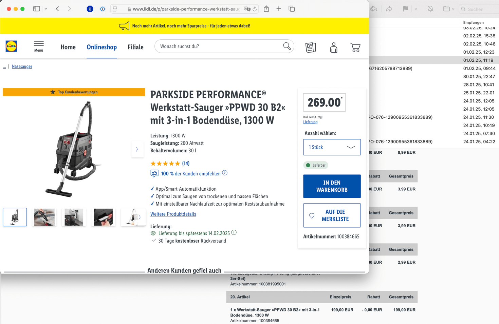
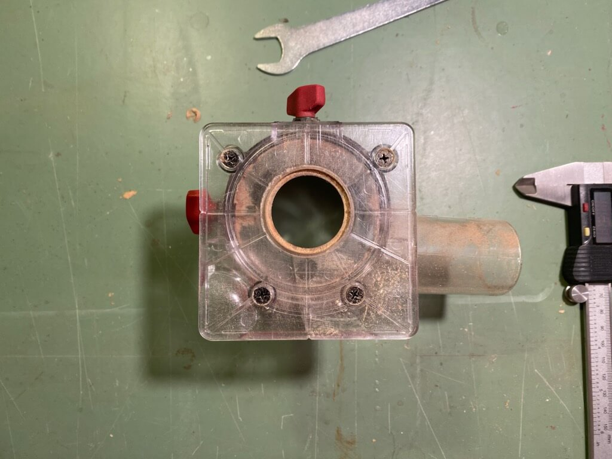
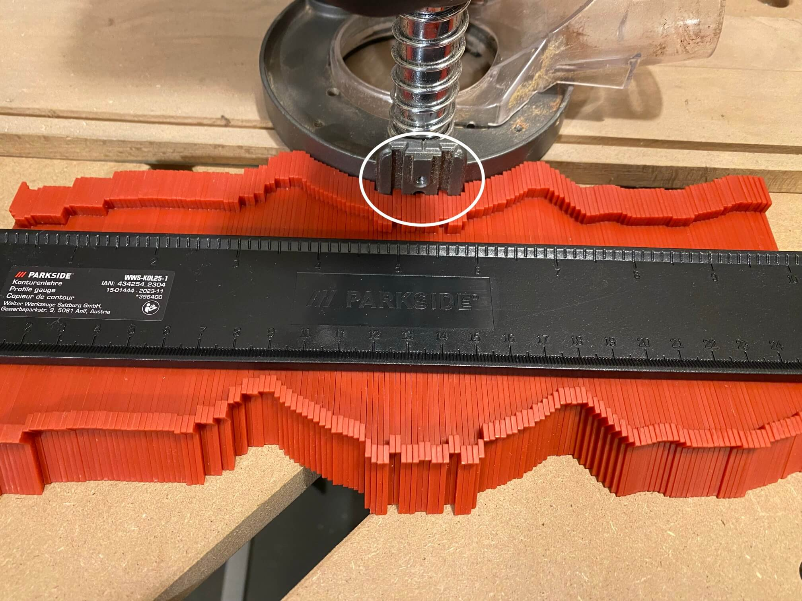
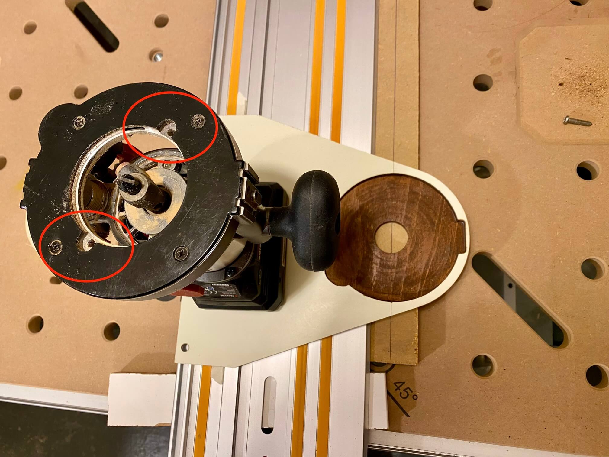
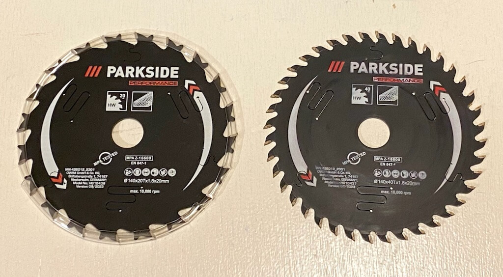
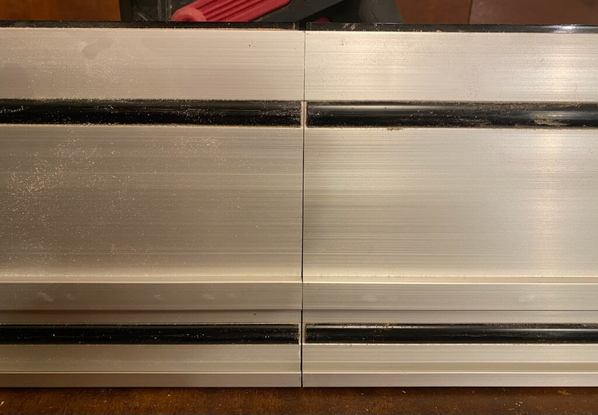

# Parkside "Performance" 20V-Akku-Werkzeuge

Werkstatt ohne vernünftig Strom und noch keine Ahnung, ob Holzwerken als Hobby Bestand hat -> erstmal 20V-Akku-Werkzeuge vom Discounter.

Nachstehend paar Notizen Stand Jan. 2025 (die natürlich automatisch mit der Zeit veralten).

## Parkside-Preisgestaltung

[Dieser Link](https://www.lidl.de/c/parkside-akku-20v/s10028203?offset=96) zeigt Stand 19. 1. 2025 insg. 103 Artikel des 20V-Systems während der [offizielle Link zu den "X20V Team"-Artikeln warum auch immer Dutzende unterschlägt](https://www.lidl.de/c/parkside-x-20-v-team/a10007371#10023133). Die Preise dort, speziell wenn Rabatte angezeigt werden, sind reine Phantasiepreise. Ein Artikel steht eine Woche drin als "10% heruntergesetzt von 99,-€ auf 89,-€" und die Woche drauf dann als "17% heruntergesetzt von 109,-€ auf 89,-€".

Es gibt bei Geräten, die sich durchsetzen (also nicht völlig Scheize sind, sich ausreichend verkaufen und nicht zu viele Rücksendungen generieren) üblicherweise zig Iterationen, die man am Namen erkennt. Produktlebenszyklus startet als A1, dann üblicherweise B2, C3, D4 und so weiter. Es tauchen vereinzelt aber auch D3-Varianten und sowas auf – aber keine Ahnung, was das bedeutet.

Üblicherweise startet ein neues Produkt (also die A1-Variante) mit einem hohen Preis, dann guckt Lidl, wie sich das entwickelt, senkt ein- oder mehrmalig im Rahmen von Rabattaktionen den Preis (bspw. von 119,- auf 79,- oder 59,-) und oft genug wird aus einem früheren Aktionspreis der neue Normalpreis. Bspw. war die "40V Säbelsäge PPSSA 40-Li A1" initial für 119,- zu haben, im Rahmen einer Rabatt-Aktion im August 2024 für 79,99€ erhältlich, der "Normalpreis" Anfang 2025 war 59,-€ und im Februar nun 99 Cent teurer 59,99€ und das angeblich um 25% reduziert von 79,99€.

Oder beispielsweise der Werkstattsauger PPWD 30 B2. Am 1. 2. 2025 für 199,-€ (Normalpreis) bestellt und 10 Tage später 70,-€ teurer (ebenfalls Normalpreis):

Das wirft auch ein Licht auf die Margen, die Lidl/Parkside trotz der niedrigen Preise immer noch einfährt (und welch lächerlicher Anteil am Gesamtpreis bei den [wirklichen Herstellern in China](https://www.youtube.com/watch?v=biZu45aIb2c) noch ankommt).

40V-Geräte sind Teil des 20V-Systems (das zu keinem Akku-System anderer Hersteller kompatibel ist), hier müssen dann einfach immer zwei Akkus ins/ans Gerät gesteckt werden.

Wo Bewertungen verfügbar sind, immer studieren und besser Finger weg von allem, was weniger als 4,0 oder gar 4,5 hat. Wobei viele Bewertungen kompletter Müll sind. Bspw. 5 Sterne für "Schnelle Lieferung, gerne wieder. Noch nicht getestet." und am anderen Ende der Skala 1-Sterne-Bewertungen à la "Ich bin zu faul, die Bedienungsanleitung zu lesen und zu doof, die Funktionsweise des Elektrowerkzeugs zu verstehen. Geht direkt zurück!1!!11!!"

Retouren, die nach Prüfung für gut befunden wurden, gehen wohl über Kanäle wie [Retoura](https://shop.retoura.de/Elektrowerkzeuge::PARKSIDE-PERFORMANCE::PARKSIDE) wieder in den Handel. Dort können die Preise aber gerne mal höher als bei lidl.de sein.

## Multifunktionsfräse PMFAP 20-Li A1

Kommt mit 3 Körben (Ober-, Kanten-, Winkelfräse), zwei Spannzangen (6 und 8 mm), Maulschlüssel, 6 Fräsern, "Parallelanschlag", Plastikkoffer und Bedienungsanleitung. Importeur ist [Kompernass](https://www.kompernass.com), die IAN ist 445966\_2307. Damit kommt man dann auch an die Anleitung als PDF unterhalb [kundenservice.lidl.de](https://kundenservice.lidl.de/SelfServiceDE/s/global-search/%40uri#q=445966_2307). Akku(s) und Ladegerät wie bei allen Geräten der Serie nicht dabei.

Reviews finden sich bei Suche nach "PMFAP 20-Li A1" viele auf YouTube, bspw. [hier](https://www.youtube.com/watch?v=A7azxTw-f8I). Von den beigelegten Fräsern sollte man natürlich nicht viel erwarten, vor allem jenseits von Weichholz ([scheint wohl auch für die separat erhältlichen "Performance"-Fräser zu gelten](https://www.youtube.com/watch?v=lWIk21K6DZk&t=391s)).

Passt auch in das deutlich höherwertigere Makita Oberfräsenmodul 195563-0, damit dann auch Makita-Parallelanschlag und Führungsschienenadapter nutzbar ([andere Makitakörbe passen aber nicht ohne Modifikationen](https://youtu.be/A7azxTw-f8I?feature=shared&t=875)). Auch [Kopierhülsen](https://youtu.be/TA6BclFsnUM?feature=shared&t=102) für "RT0700C" oder "DRT50" sollten dann nutzbar sein.

[1/4"-Spannzange (6,35 mm) aus China](https://www.temu.com/goods.html?_bg_fs=1&goods_id=601099550332274&sku_id=17592358904798) passt wunderbar. Der Durchmesser der Auflage des Parkside-Oberfräskorbs ist 122,2 mm, der Kantenfräskorb bringt es auf 90x90 mm aber die Position der Bohrlöcher erschwert das Bauen von Universal-Jigs wie bspw. [diesem hier](https://www.youtube.com/watch?v=NndFGhc4_Ng):

Der Oberfräskorb hat an jeder Seite in 17mm Höhe ein M4-Gewinde zur Befestigung des windigen "Parallelanschlags", das hier jetzt für T-Nut-Adapter (bspw. für [Fräszirkel](../media/Kreisfraeser/README.md)) verwendet wird.

In der Bodenplatte des Oberfräskorbs sind außerdem zwei M5-Gewinde, die hier zur Befestigung eines [Führungsschienenadapters](../media/Fraesschiene/README.md) verwendet werden:

## Tauchsäge PPTSA 20-Li A1

Die A1-Variante war ursprünglich für 159,- gelistet ist aber schon nicht mehr erhältlich. Anfang 2025 war die [C3-Nachfolgerin](https://www.lidl.de/p/parkside-performance-20-v-akku-tauchsaege-pptsa-20-li-c3-ohne-akku-und-ladegeraet/p100382688) für 89,-€ im Angebot. Importeur ist [Grizzly Tools](https://grizzlytools.shop) und IAN ist 396073\_2201 -> [Link zur Bedienungsanleitung](https://kundenservice.lidl.de/SelfServiceDE/s/global-search/%40uri#q=396073_2201).

Lieferumfang neben der Säge ist ein bereits montiertes Sägeblatt mit 42 Zähnen (20mm Durchmesser innen, 140mm außen -> Schnittiefe bei 0° damit 52 mm maximal), zwei 70cm Führungsschienen samt Verbinder, "Parallelanschlag", ein unflexibles Reduzierstück für Staubsaugeranschluß, Plastikkoffer und Bedienungsanleitung.

Trotz beworbener Schnittwinkel von 1°-47° schafft mein A1-Modell keine 45° (irgendwo bei 44,x° ist Schluß) also evtl. [Vorrichtung für perfekte Gehrung bauen](https://www.youtube.com/watch?v=4WEJXS8R0Jo) und vermutlich ist das in späteren Geräterevisionen schon gefixt.

Ab und an gibt es bei lidl.de ein "Parkside Performance"-Sägeblatt mit 140mm Durchmesser, 1,3mm Breite und 40 Zähnen mit der Bestellnummer 100368884001, das **deutlich** schärfer ist als das vormontierte (wie bei allen Billigsägen wird halt überall gespart und Austausch des Sägeblatts gegen was Gutes sollte erste Maßnahme sein).

Update: Mit der IAN 426012_2301 vertreibt die Schwarz-Gruppe von Zeit zu Zeit insgesamt vier passende "Performance"-Sägeblätter, siehe bspw. [https://shop.retoura.de/PARKSIDE-PERFORMANCE-Kreissaegeblatt-140-mm-B-Ware](https://shop.retoura.de/PARKSIDE-PERFORMANCE-Kreissaegeblatt-140-mm-B-Ware).

Völlig vergessen: Juli 2024 das Performance-Sägeblatt mit 20 Zähnen (Bestellnummer 100368884002) für vermutlich reduzierte 5€ gekauft. Das mit 40 Zähnen hat im März 2024 15€ gekostet:

Wenn diese "Performance"-Sägeblätter irgendwann durch sind, steht hier die Anschaffung eines/mehrerer "Bosch Expert for Wood 140 x 20" an (taugt als Web-Suchbegriff). Die haben die passenden Innen- und Außendurchmesser, schneiden 1,8mm breit, kommen mit 24, 36 oder 42 Zähnen und gehen nach Abnutzung zum Nachschärf-Service. Bosch hat auch ein passendes Alu-Sägeblatt mit 50 Zähnen und 1,6mm Breite und von Milwaukee gibt es ein Holz-Sägeblatt mit 1,3mm Breite und 18 Zähnen ([Artikel-Nummer 4932471310](https://www.idealo.de/preisvergleich/OffersOfProduct/200900879_-4932471310-milwaukee.html))

Die beiden 70cm-Führungschienen per Verbinder zu einer _geraden_ 140er zu machen, klappt zumindest bei meinen Schienen nur auf planer Unterlage vertikal montiert, da zumindest eine Schiene nicht rechtwinklig ist:

Sieht Scheize aus aber funktioniert klaglos.

Ansonsten passt die Säge auf viele zu Festool kompatible Führungsschienen ([zumindest auf Evolution, Festool natürlich, Metabo, andere Parkside wie bspw. die der PTSS 1200, Walter und Youtool aber definitiv _nicht_ auf Bosch, DeWalt, Einhell, Maffel, Makita oder Scheppach](https://www.youtube.com/watch?v=EVyqmbYERt0). Auch kompatibel ist bspw. dieser [Billig-Festool-Klon](https://www.temu.com/goods.html?_bg_fs=1&goods_id=601099647544073&sku_id=17592707091511), dessen Preis warum auch immer andauernd zwischen 27€ und 43€ schwankt und das [neue Festool-Format mit zusätzlicher Zubehör-T-Nut](https://www.festool.de/blog/news/fs-2-0) kopiert während bspw. Youtool oder Parkside selbst das alte Format ohne zusätzliche T-Nut kopieren (gibt einiges an Festool-Zubehör, das die "neue" T-Nut umgreifen will, das klappt mit Schienen nach dem alten Layout natürlich nicht).

Der Schienensteg der beiden 70cm-Parkside-Schienen ist nur 15,8mm breit (16mm beim Festtool-Original), d.h. wer häufig Schienen wechselt darf andauernd an der Bodenplatte der Säge nachjustieren.

Schienenzwingen liegen keine bei, so gut wie alle für Festool-kompatible Schienen dürften aber passen. Youtool bspw. verkauft stinknormale Bessey GTR12 (Ganzstahl-Tischzwinge mit 120mm Länge – andere GTR-Zwingen auch mit Hebelgriff passen also auch), die Festtool-Zwingen passen bei Parkside-Schiene (ergo auch [Makita, Metabo, usw. usf.](https://archive.ph/7SN7d)). Wenn man noch nicht "zu viele" Zwingen hat, ist evtl. das [Bessey EZR15-6SET ](https://geizhals.de/bessey-ezr15-6set-einhand-tischzwinge-a2444634.html) eine Idee: zwei 150mm-Einhandzwingen, mit denen man sowohl spannen als auch spreizen und in Führungsschienen als auch T-Nuten fixieren kann (siehe [hier](../media/Anhaengerpodest/012.jpg) für Beispiel).

## Werkstattsauger PPWD 30 B2

Natürlich kein Akku-Tool aber notwendig, denn der vormals im Einsatz befindliche [20V-Akkusauger PWDA 20-Li A2](https://www.lidl.de/p/parkside-20-v-akku-nass-und-trockensauger-pwda-20-li-a2-ohne-akku-und-ladegeraet/p100345284) hat einfach nicht die nötige Leistung, um an Feinstaub erzeugendem Werkzeug betrieben zu werden.

Hersteller ist Grizzly Tools, ebendort auch [Verbrauchsmaterial und Ersatzteile](https://grizzlytools.shop/search/?qs=PPWD) ([woanders aber oft günstiger](https://www.staubsaugermanufaktur.de/advanced_search_result.php?keywords=PPWD)), IAN ist die 465676\_2404 und hier der [Link zum Manual](https://manuals.sit-connect.com/public/articlemanual/f44c6445-daf3-45c3-a647-9d7c052162d5.pdf). Als Filtertüten gibt es das 4er-Set "PPVFT 30 A1" (Staubklasse H, Feb. 2025 für 13,-€) oder "PVFT 30 A1" meist im 10er-Pack.

Das A1-Vorgängermodell gab es 2024 für 249,-€ ([diverse Rezensionen bspw. auf YouTube](https://www.youtube.com/results?search_query=PPWD+30)). Staubklasse H, fiel robust aus aber die Kopplung mit Akkuwerkzeugen bzw. Parkside-Akkus eher bekloppt. Die B2-Version bringt jetzt einen BT-Sender für den Saugschlauch mit, was für Akku-Werkzeuge egal welchen Herstellers perfekt ist.

Auf dem Ding sollen die stapelbaren Parkside-Sortiment-Boxen arretiert werden können, die Feb. 2025 drastisch reduziert erhältlich waren ([Box L für 8€](https://www.lidl.de/p/parkside-sortimentsbox-l-kombinier-und-stapelbar/p100368823), [Box M für 5€](https://www.lidl.de/p/parkside-sortimentsbox-m-kombinier-und-stapelbar/p100368835)). Diese Boxen haben die selbe Grundfläche wie das Bosch L-Boxx-System [sind aber nicht wirklich kompatibel dazu](https://youtu.be/Y-IU3M3cTYc?feature=shared&t=610).

Außendurchmesser Saugschlauch 57,5cm, innen 52,8