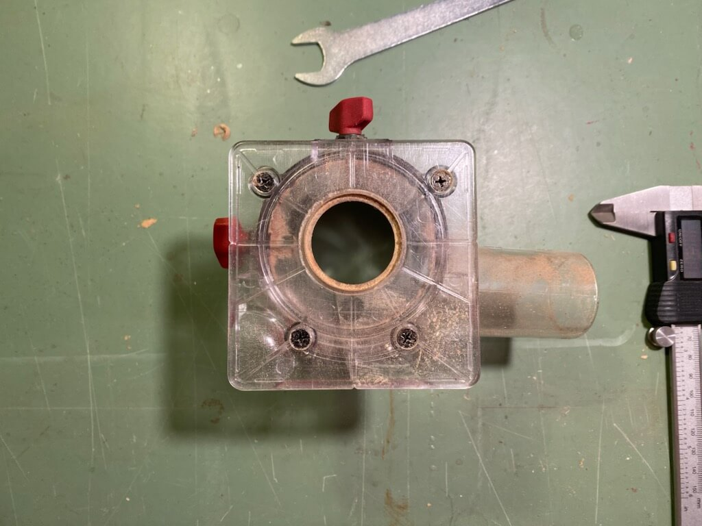
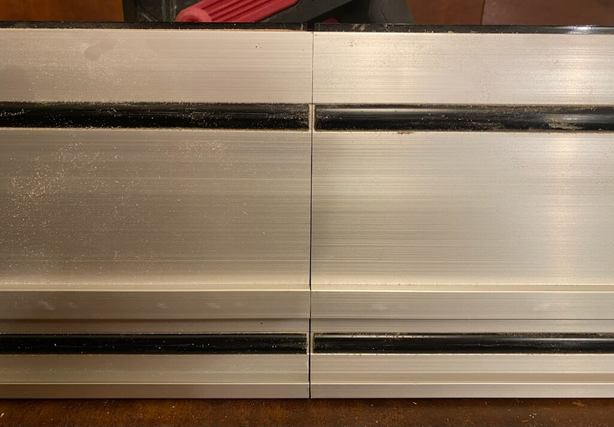

# Parkside "Performance" 20V-Akku-Werkzeuge

Werkstatt ohne vernünftig Strom und noch keine Ahnung, ob Holzwerken als Hobby Bestand hat -> erstmal 20V-Akku-Werkzeuge vom Discounter.

Nachstehend paar Notizen Stand Jan. 2025 (die natürlich automatisch mit der Zeit veralten).

## Parkside-Preisgestaltung

[Dieser Link](https://www.lidl.de/c/parkside-akku-20v/s10028203?offset=96) zeigt Stand 19. 1. 2025 insg. 103 Artikel des 20V-Systems während der [offizielle Link zu den "X20V Team"-Artikeln warum auch immer Dutzende unterschlägt](https://www.lidl.de/c/parkside-x-20-v-team/a10007371#10023133). Die Preise dort, speziell wenn Rabatte angezeigt werden, sind reine Phantasiepreise. Ein Artikel steht eine Woche drin als "10% heruntergesetzt von 99,-€ auf 89,-€" und die Woche drauf dann als "17% heruntergesetzt von 109,-€ auf 89,-€".

Es gibt bei Geräten, die sich durchsetzen (also nicht völlig Scheize sind, sich ausreichend verkaufen und nicht zu viele Rücksendungen generieren) üblicherweise zig Iterationen, die man am Namen erkennt. Produktlebenszyklus startet als A1, dann üblicherweise B2, C3, D4 und so weiter. Es tauchen vereinzelt aber auch D3-Varianten und sowas auf – aber keine Ahnung, was das bedeutet.

Üblicherweise startet ein neues Produkt (also die A1-Variante) mit einem hohen Preis, dann guckt Lidl, wie sich das entwickelt, senkt ein- oder mehrmalig im Rahmen von Rabattaktionen den Preis (bspw. von 119,- auf 79,- oder 59,-) und oft genug wird aus einem früheren Aktionspreis der neue Normalpreis. Bspw. war die "40V Säbelsäge PPSSA 40-Li A1" initial für 119,- zu haben, im Rahmen einer Rabatt-Aktion im August 2024 für 79,99€ erhältlich und der "Normalpreis" Anfang 2025 ist 59,-€. Das wirft auch ein Licht auf die Margen, die Lidl/Parkside trotz der niedrigen Preise immer noch einfährt (und welch lächerlicher Anteil am Gesamtpreis bei den [wirklichen Herstellern in China](https://www.youtube.com/watch?v=biZu45aIb2c) noch ankommt).

40V-Geräte sind Teil des 20V-Systems (das zu keinem Akku-System anderer Hersteller kompatibel ist), hier müssen dann einfach immer zwei Akkus ins/ans Gerät gesteckt werden.

Wo Bewertungen verfügbar sind, immer studieren und besser Finger weg von allem, was weniger als 4,0 oder gar 4,5 hat. Wobei viele Bewertungen kompletter Müll sind. Bspw. 5 Sterne für "Schnelle Lieferung, gerne wieder. Noch nicht getestet." und am anderen Ende der Skala 1-Sterne-Bewertungen à la "Ich bin zu faul, die Bedienungsanleitung zu lesen und zu doof, die Funktionsweise des Elektrowerkzeugs zu verstehen. Geht direkt zurück!1!!11!!"

## Multifunktionsfräse PMFAP 20-Li A1

Kommt mit 3 Körben (Ober-, Kanten-, Winkelfräse), zwei Spannzangen (6 und 8 mm), Maulschlüssel, 6 Fräsern, "Parallelanschlag", Plastikkoffer und Bedienungsanleitung. Importeur ist [Kompernass](https://www.kompernass.com), die IAN ist 445966\_2307. Damit kommt man dann auch an die Anleitung als PDF unterhalb [kundenservice.lidl.de](https://kundenservice.lidl.de/SelfServiceDE/s/global-search/%40uri#q=445966_2307). Akku(s) und Ladegerät wie bei allen Geräten der Serie nicht dabei.

Reviews finden sich bei Suche nach "PMFAP 20-Li A1" viele auf YouTube, bspw. [hier](https://www.youtube.com/watch?v=A7azxTw-f8I). Von den beigelegten Fräsern sollte man natürlich nicht viel erwarten, vor allem jenseits von Weichholz ([scheint wohl auch für die separat erhältlichen "Performance"-Fräser zu gelten](https://www.youtube.com/watch?v=lWIk21K6DZk&t=391s)).

Passt auch in das deutlich höherwertigere Makita Oberfräsenmodul 195563-0, damit dann auch Makita-Parallelanschlag und Führungsschienenadapter nutzbar ([andere Makitakörbe passen aber nicht ohne Modifikationen](https://youtu.be/A7azxTw-f8I?feature=shared&t=875)). Auch [Kopierhülsen](https://youtu.be/TA6BclFsnUM?feature=shared&t=102) für "RT0700C" oder "DRT50" sollten dann nutzbar sein.

[1/4"-Spannzange (6,35 mm) aus China](https://www.temu.com/goods.html?_bg_fs=1&goods_id=601099550332274&sku_id=17592358904798) passt wunderbar. Der Durchmesser der Auflage des Parkside-Oberfräskorbs ist 122,2 mm, der Kantenfräskorb bringt es auf 90x90 mm aber die Position der Bohrlöcher erschwert das Bauen von Universal-Jigs wie bspw. [diesem hier](https://www.youtube.com/watch?v=NndFGhc4_Ng):

## Tauchsäge PPTSA 20-Li A1

Die A1-Variante war ursprünglich für 159,- gelistet ist aber schon nicht mehr erhältlich. Anfang 2025 war die [C3-Nachfolgerin](https://www.lidl.de/p/parkside-performance-20-v-akku-tauchsaege-pptsa-20-li-c3-ohne-akku-und-ladegeraet/p100382688) für 89,-€ im Angebot. Importeur ist [Grizzly Tools](https://grizzlytools.shop) und IAN ist 396073\_2201 -> [Link zur Bedienungsanleitung](https://kundenservice.lidl.de/SelfServiceDE/s/global-search/%40uri#q=396073_2201).

Lieferumfang neben der Säge ist ein bereits montiertes Sägeblatt mit 42 Zähnen (20mm Durchmesser innen, 140mm außen -> Schnittiefe bei 0° damit 52 mm maximal), zwei 70cm Führungsschienen samt Verbinder, "Parallelanschlag", ein unflexibles Reduzierstück für Staubsaugeranschluß, Plastikkoffer und Bedienungsanleitung.

Trotz beworbener Schnittwinkel von 1°-47° schafft mein A1-Modell keine 45° (irgendwo bei 44,x° ist Schluß) also evtl. [Vorrichtung für perfekte Gehrung bauen](https://www.youtube.com/watch?v=4WEJXS8R0Jo) und vermutlich ist das in späteren Geräterevisionen schon gefixt.

Ab und an gibt es bei lidl.de ein "Parkside Performance"-Sägeblatt mit 140mm Durchmesser und 40 Zähnen mit der Bestellnummer 100368884001, das **deutlich** schärfer ist als das vormontierte (wie bei allen Billigsägen wird halt überall gespart und Austausch des Sägeblatts gegen was Gutes sollte erste Maßnahme sein). Wenn dieses "Performance"-Sägeblatt irgendwann durch ist, steht hier die Anschaffung eines/mehrerer "Bosch Expert for Wood 140 x 20" an (taugt als Web-Suchbegriff). Die haben die passenden Innen- und Außendurchmesser, kommen mit 24, 36 oder 42 Zähnen und gehen nach Abnutzung zum Nachschärf-Service. Bosch hat auch ein passendes Alu-Sägeblatt mit 50 Zähnen und 1,6mm Breite.

Die beiden 70cm-Führungschienen per Verbinder zu einer _geraden_ 140er zu machen, klappt zumindest bei meinen Schienen nur auf planer Unterlage vertikal montiert, da zumindest eine Schiene nicht rechtwinklig ist:

Sieht Scheize aus aber funktioniert klaglos.

Ansonsten passt die Säge auf viele zu Festool kompatible Führungsschienen ([zumindest auf Evolution, Festool natürlich, Metabo, andere Parkside wie bspw. die der PTSS 1200, Walter und Youtool aber definitiv _nicht_ auf Bosch, DeWalt, Einhell, Maffel, Makita oder Scheppach](https://www.youtube.com/watch?v=EVyqmbYERt0). Auch kompatibel ist bspw. dieser [Billig-Festool-Klon](https://www.temu.com/goods.html?_bg_fs=1&goods_id=601099647544073&sku_id=17592707091511), dessen Preis warum auch immer andauernd zwischen 27€ und 43€ schwankt und das [neue Festool-Format mit zusätzlicher Zubehör-T-Nut](https://www.festool.de/blog/news/fs-2-0) kopiert während bspw. Youtool oder Parkside selbst das alte Format ohne zusätzliche T-Nut kopieren (gibt einiges an Festool-Zubehör, das die "neue" T-Nut umgreifen will, das klappt mit Schienen nach dem alten Layout natürlich nicht).

Der Schienensteg der beiden 70cm-Parkside-Schienen ist nur 15,8mm breit (16mm beim Festtool-Original), d.h. wer häufig Schienen wechselt darf andauernd an der Bodenplatte der Säge nachjustieren.

Schienenzwingen liegen keine bei, so gut wie alle für Festool-kompatible Schienen dürften aber passen. Youtool bspw. verkauft stinknormale Bessey GTR12 (Ganzstahl-Tischzwinge mit 120mm Länge – andere GTR-Zwingen auch mit Hebelgriff passen also auch), die Festtool-Zwingen passen bei Parkside-Schiene (ergo auch [Makita, Metabo, usw. usf.](https://www.holzwerken.net/blog/heiko-rech/schienen-adapter-saegen-was-passt-wo/)). Wenn man noch nicht "zu viele" Zwingen hat, ist evtl. das [Bessey EZR15-6SET ](https://geizhals.de/bessey-ezr15-6set-einhand-tischzwinge-a2444634.html) eine Idee: zwei 150mm-Einhandzwingen, mit denen man sowohl spannen als auch spreizen und in Führungsschienen fixieren kann.