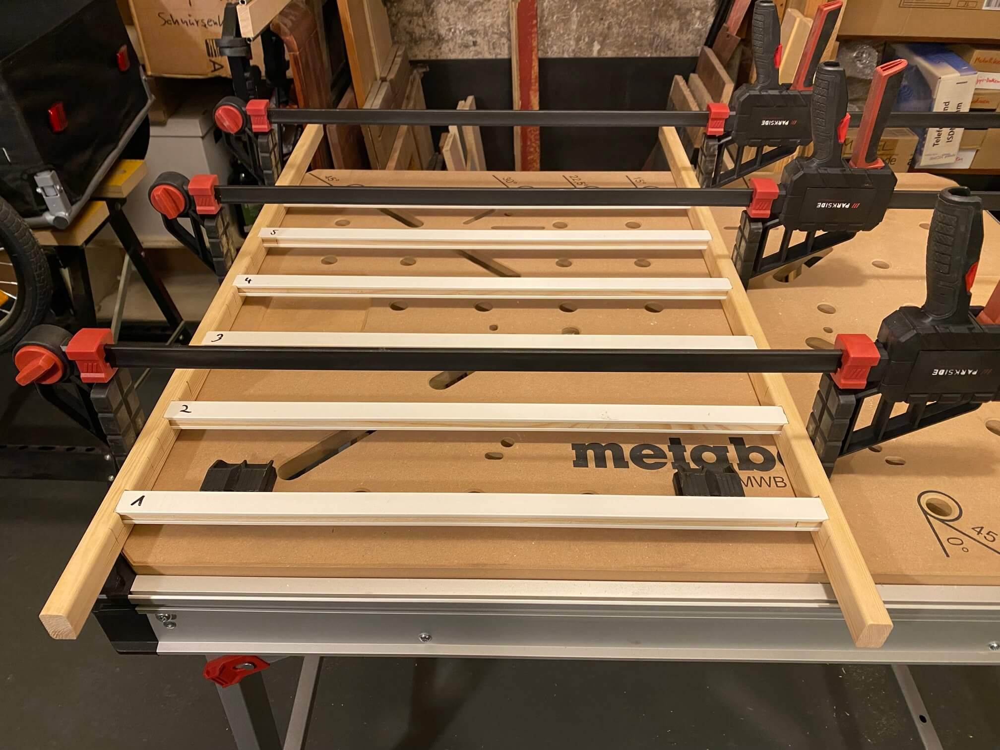
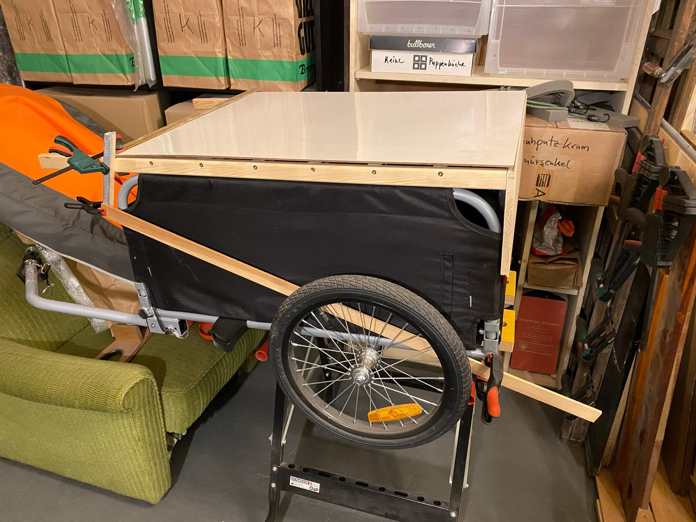
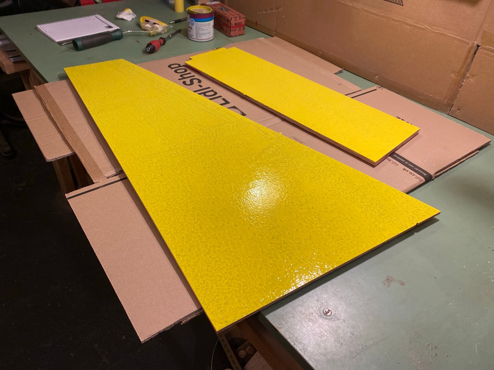
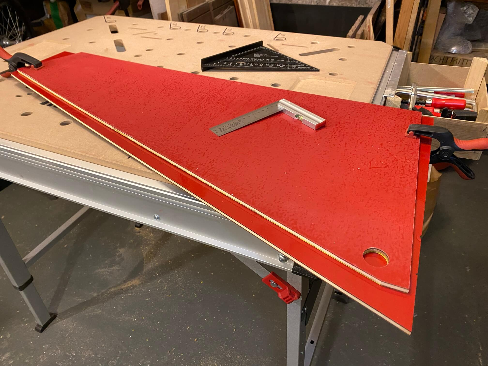
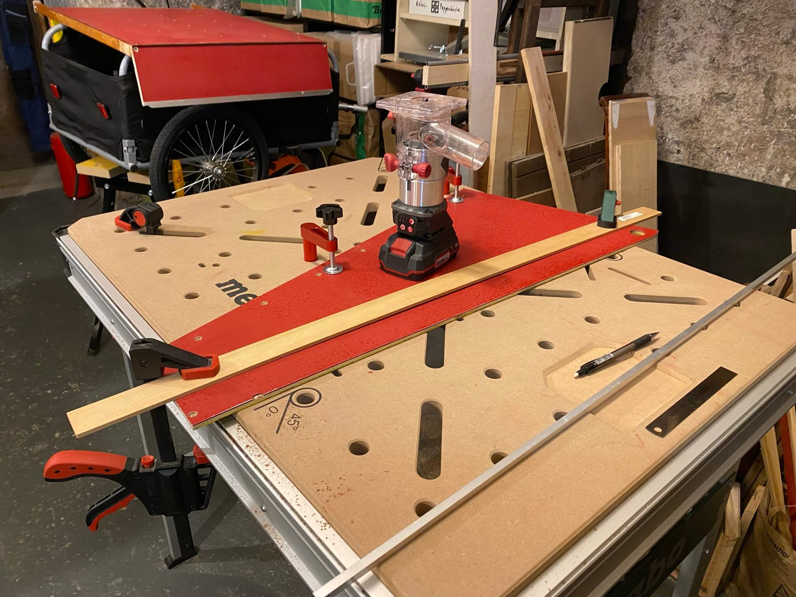

# Anhängerdeckel

Vorgeschichte: Da Bedarf für Fahrradanhänger zunahm nach Internet-Recherche und Blick in den Hausflur, wo so ein Anhänger seit Jahren herumsteht, den Besitzer (Gastronomie im EG) gefragt, wo er das Ding her hat.

"Aus dem Internet" hieß es und "Kannste haben, das Ding kann man nicht vernünftig sichern".

Daher Idee: Als an und für sich wenig sinniges Projekt einen abschließbaren Deckel für den Anhänger bauen, um vertrauter mit Werkzeug und Werkstoffen zu werden. Der eigentliche Sinn besteht also im Üben und idealerweise Material verbauen, das eh herumliegt. Und Anhänger in Zukunft gemeinsam zu nutzen statt neuen zu kaufen.

Grundidee: Aus Regal- und Schrankrückwandresten und Aluprofilen einen Korpus bauen, der als "Scharnier" die Überstände des hinteren unteren Metallrohrs des Hängers nutzt. Vorne kommt ein Vorhängeschloß dran und fertig.

#### Alte Billy-Regalrückwand und Aluprofilreste von Küchenrenovierung nebenan scheinen von der Breite zu passen:

#### Schrankrückwandreste als Seitenteile auch (wobei dieses Brett als Teil der Rückwand endete)

#### Erstmal mit Oberfräse und Stechbeitel Vertiefung in Latten, um Aluprofile einzufassen:

#### Aluprofile mit Trennschleifer auf gleiche Länge bringen:

#### Das wird dann das verstärkte Dach, drüber kommt alte 4mm starke Billy-Regalrückwand:

#### Regalrückwand abschleifen und grundieren:

#### Mit Tauchsäge Holzstäbchen sägen, um sie in die Profile zu stecken, damit von oben und der Seite hineingeschraubt werden kann:

#### Aufgrund kleiner Toleranzen und nicht exakt gerader Latten Zeugs sortieren und numerieren:

#### Test-Fitting Seitenteile und Winkelbestimmung:

#### Lackrest auf Grundierung aufbringen:

#### Abstände ermittelt, aus Holzresten und Spannzwingen "Scharnier"-Mechanismus gebaut und testen:

#### Funktioniert aber das Gesamtkonstrukt braucht im aufgeklappten Zustand "Füße". Also wird das Oberteil einfach um 180° gedreht und der Lattenüberstand, der eigtl. abgesägt werden sollte, zum Aufstützen verwendet:

#### Andere Außenflächen ebenfalls rot lackieren:

#### Rückwand soll eine Aussparung erhalten. Um Holz zu sparen aus 4 Brettern mit Leim+Dübeln eines machen. Und schon Fehler: Beim Leimen nicht auf Maserungsrichtung geachtet:

#### Grundieren auf Innenseiten fortsetzen:

#### Das vorher verleimte Brett wird jetzt noch flächig mit 4mm Schrankrückwandrest verleimt, das bringt dann auch Stabilität:

#### So sieht die Außenseite aus:

#### Immer noch nicht verinnerlicht, dass ne Oberfräse im Haus ist und stattdessen mit Forstnerbohrer und Stichsäge herumdilletiert:

#### Schönes Astloch freigelegt. Trotzdem mit der Kantenfräse einmal rum, um zu gucken, wie schlimm das wird:

#### Ausbessern üben, aus Reststück rechteckigen Ersatz raussägen:

#### Mit Handsäge und Stechbeitel passende Aussparung erzeugen:

#### Flicken mit Holzleim appliziert:

#### Für die "Füße" Alusohlen herstellen:

#### M5-Gewinde reinschneiden, alles verkleben und verschrauben:

#### Alle Außenteile (nach fälligen Ausbesserungen) nochmal lackieren:

#### Falsche Reihenfolge: erst lackieren, dann denken. In Folge wird zwangsweise ein Außen- zum Innenteil:

#### Alles geschliffen und bereit zur Montage:

#### Rückwand und Dach werden mit Holzleim und Nagelpistole verbunden. Noch nicht sonderlich stabil aber das werden die Seitenteile (hoffentlich) später richten.

#### Da noch Dose gelber Lack seit D-Mark-Zeiten herumsteht, beschlossen, die Innenteile gelb zu lackieren (in erster Linie um irgendeinen Schutz aufzutragen)

#### Am Dach Position der Bohrlöcher ermitteln und dann alles körnen, bohren, senken und verschrauben:

#### Nun Seitenteile finalisieren, also temporär anbringen, ausmessen, entscheiden, wo das "Scharnier" exakt hinkommt:

#### Diese 5-6mm Überstand je Seite bilden dann mit 25mm-Löchern in den Seitenteilen den Scharniermechanismus:

#### Aber erstmal Frontteil anbringen, jetzt wo alle Winkel bestimmt sind:

#### "Überraschung": beim Deckel verschrauben geschlampt, jetzt ist ein Beinchen paar mm länger als das andere und das Frontteil muß an einer Seite per Fräse/Stechbeitel 2mm dünner gemacht werden:

#### Frontteil montiert:

#### Nun kann mit Zuschnitt und Montage der Seitenteile begonnen werden:

#### Alles doppelt gemessen aber Referenz vergeigt und "Scharnierloch" eigentlich viel zu tief gebohrt:

#### Ist aber nicht so schlimm bzw. noch in der Toleranz, also weitermachen:

#### Spalt füllen, später kommt hier ein 1,5mm starkes Alu-Profil drüber:

#### Maße auf anderes Seitenteil übertragen:

#### Test-Fitting passt:

#### Bohrlöcher anzeichnen, um Seitenteile oben mit Leisten zu verschrauben:

#### Letzter Holz-Zuschnitt: Rückwand wird unten auf richtige Länge gekürzt:

#### Aluprofile, die witzigerweise bis auf vier in den passenden Stärken eh herumlagen, einkleben/verschrauben, um die Kanten zu schützen.

#### Mit Elektrohobel Balken begradigen und Holzschutz drauf:

#### Unten an den Seitenteilen sollen Alu-U-Profile schützen, dafür müssen aber 0,8mm Material abgetragen werden:

#### Passt nun perfekt:

#### An den Rückseiten der Seitenteile werden T-Profile verklebt/verschraubt:

#### Löcher mit Gewinde dienen dazu, Aluprofil und Seitenteil fix zu verbinden, durch die Löcher ohne Gewinde wird dann durchgeschraubt, um Seitenteile mit der Rückwand zu verbinden.

#### Für die Rückwandverschraubung Bohrlöcher gesenkt, Alu-Profil und Seitenteil final verklebt und verschraubt:

#### Zwei 45°-Leisten sägen, die innen im Deckel an den Außenseiten verklebt werden, um den Deckel zu zentrieren:

#### U-Profile einkleben:

#### Jetzt L-Profile fürs Dach zuschneiden bzw. Aussparungen für Füße einarbeiten:

#### Rückseitiges L-Profil einkleben:

#### Seitliche L-Profile passend gemacht und zwischendurch montiert kurzer "Test" auf dem Boden:

#### Seitliche L-Profile einkleben:

#### Ab jetzt nur noch Fitzelkram: vordere L-Profile von Hand zusägen und verkleben:

#### Vordere Messingleiste einkleben (Parkettleiste, die nach Renovierung einer Wohnung im Haus mitsamt Türrahmen irgendwann neben der Kellertür stand):

#### Deckel wieder demontiert (je 4 Schrauben in den rückwärtigen T-Profilen zu lösen) und Vorbereitung finale Lackierung:

#### Jetzt "Zentrierleisten" innen einkleben:

#### Und als vorletzter Schritt noch 4 Kistenecken mit 2K-Kleber und kleinen Schrauben anbringen.

#### Noch bisschen Reflektorfolie drauf und Vorhängeschloß dran.

#### Aus Profilresten noch zwei Miniabschlüsse gesägt/gefeilt und mit 2K-Kleber an die Messingleiste:

#### Erste Probefahrt insofern bestanden, als sich nichts losvibriert hat. Aber bisschen zu sehr Klapperkiste, da muß noch mit Dichtungsband oder was-auch-immer nachgearbeitet werden:

#### Lernerfolge:

  * Tischlerplatten bisschen doof, da in der mittleren Schicht gerne Überraschungen in Form von Astlöchern oder unsauberen Verleimungen warten
  * "eigentlich rechtwinklig" muß nicht wirklich rechtwinklig sein
  * zweimal nachmessen bringt nix, wenn man nicht drauf achtet, von wo aus man gemessen hat (Ober- oder Unterseite bspw.)
  * Wenn man mit [Dübelleiste](https://www.wolfcraft.com/products/wolfcraft/de/EUR/Produkte/Vorsatz%C2%ADgeräte-für-Maschinen/Bohrhilfen/Dübelleiste/p/P_4650) werkelt, horizontal bohren und nicht vertikal von oben
  * Wechsel von Trennscheibe zu Sägeblatt in der Flex ([siehe hier](https://github.com/ThomasKaiser/Basteln/blob/main/media/Kreisfraeser/010.jpg)) bringt massive Verbesserungen mit Alu: wird geschnitten und nicht geschmolzen
  * Handwerkzeuge sind geil! Vor allem im Winter im 8° kalten Keller.
