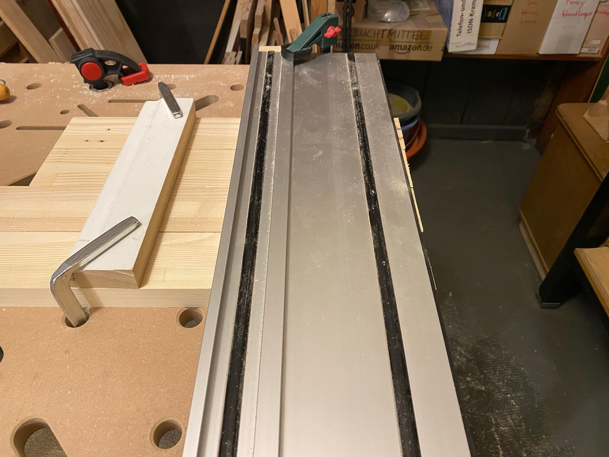
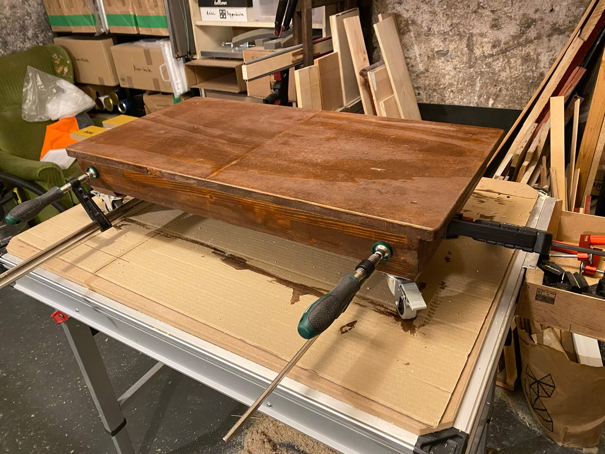
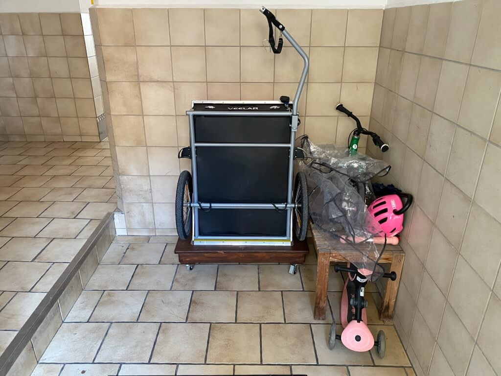

# Anhängerpodest

Idee: ein schwenkbares Podest, das ermöglicht, den [Radanhänger](../Anhaengerdeckel/README.md) platzsparend im Treppenhaus an der Wand zu verstauen und bei Bedarf so einzuschwenken, dass der Anhänger bequem auf 
das Podest gesenkt bzw. davon wieder runter geschwenkt werden kann.

Holz für lau von [Treibgut (die retten tonnenweise Material, und was sie nicht mehr brauchen, kann unsereins dann noch retten)](http://treibgut-lager.de). Die Rolle/Lenkrollen stammen aus dem letzten Jahrhundert, lagen im Schrank und hatten noch D-Mark-Preise draufkleben.

#### Balken von Nägeln/Klammern befreien und dann mit Elektrohobel drüber:

#### Dann Versuch, 45° Gehrung zu sägen:

#### Überraschung: leider kann die Tauchsäge nur 44,x° also noch bisserl nachgeschliffen und dann rechtwinklig verleimt:

#### Parallel für den Deckel zwei Reststücke Tischlerplatte mittels [Dübelleiste](https://www.wolfcraft.com/products/wolfcraft/de/EUR/Produkte/Vorsatz%C2%ADgeräte-für-Maschinen/Bohrhilfen/Dübelleiste/p/P_4650) und Holzdübeln verleimt:

#### Nach 24 Stunden im 45°-Winkel 8er Löcher in die Ecken gebohrt und mit Holzdübeln verleimt:

#### Die zahllosen Bohrlöcher mit Holzdübelabschnitten und Zahnstocher gefüllt und verleimt. Anschl. Überstand abgesägt, Kanten angefast und alles geschliffen:

#### In die Mitte soll noch eine Leiste als Verstärkung also Nut der passenden Stärke fräsen, mit Stechbeitel gerade machen und mit Holzdübeln verstärken:

#### Deckel formatieren und Kanten abrunden:

#### Mittels Taschenlöchern Deckel und Rahmen verschrauben:

#### Zweimal Holzschutz "Palisander" drauf:

#### Dann Lattenabschnitte einkleben, so dass die Rollen für die passende Höhe montiert werden können:

#### Fertig ist das Dreirad:

#### Noch eine zusätzliche Schicht Arbeitsplattenöl im Warmen auftragen:

#### Fertig: Der Niveauunterschied im Treppenhaus kann jetzt ohne Herumwuchten ganz einfach durch Schwenken überwunden werden:

#### Lernerfolge:

  * Zumindest die 1. Iteration (A1) der Parkside Akku-Tauchsäge PPTSA 20-Li kann trotz beworbener Schnittwinkel von 1°-47° keine 45° (irgendwo bei 44,x° ist Schluß) also in Zukunft evtl. [Vorrichtung für perfekte Gehrung bauen](https://www.youtube.com/watch?v=4WEJXS8R0Jo)
  * Wenn Löcher für Dübel gebohrt werden, Bohrlöcher akribisch aussaugen und nicht nur ausklopfen
  * Dunkle Lasur draufklatschen, um Fehler zu vertuschen, kann am Ende scheizer ausschauen als helles Holz, dem man Arbeitsschritte ansieht