# Deckelknauf

Den Glasdeckel hab ich von meiner Mutter "geerbt", die dazugehörige Pfanne ist aber schon vor Jahrzehnten verstorben. Heute gemerkt, dass der Knauf leichtes Spiel hat. Dann beim Anziehen das Plastikgewinde finalmente rausgebrochen. Da die M5-Schraube auch ordentlich verrostet ist, kein 2K-Reparaturversuch sondern Holzersatz.

#### Ausgangssituation:

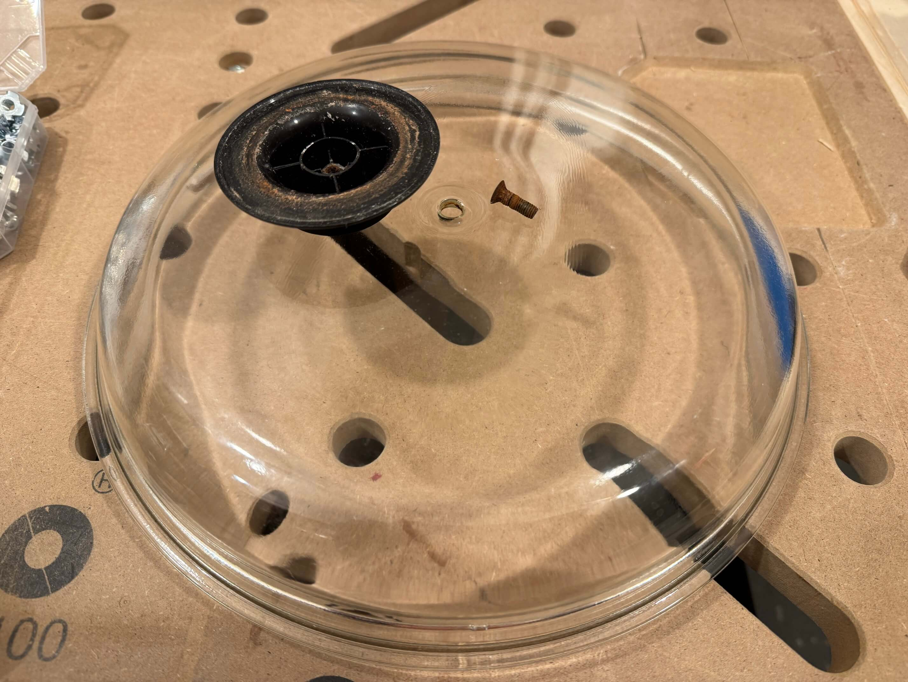

#### Zwei Ex-Flaschenkorken vom Kork getrennt und in die breitere ein halbwegs passendes Rundholz eingeleimt:

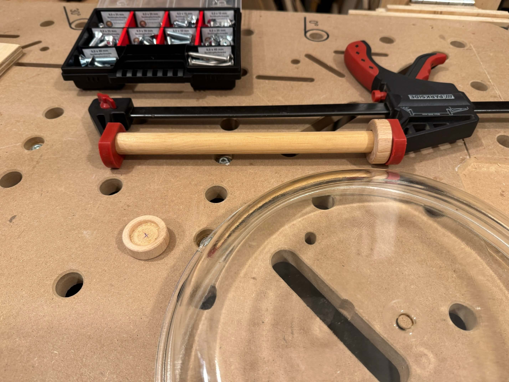

#### Rundholz abgelängt so dass der vormals vom Kork belegte Hohlraum wieder mit Holz gefüllt ist:

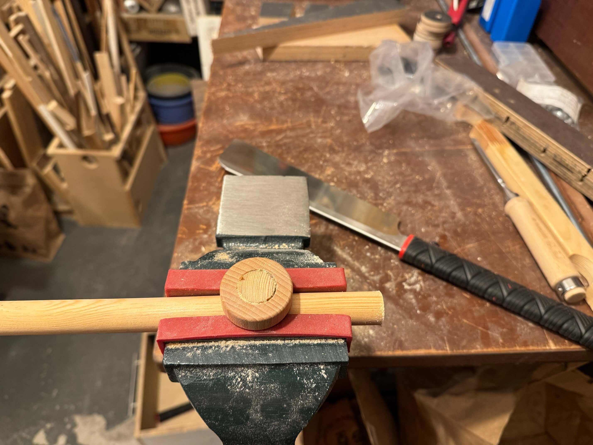

#### Flott plan schleifen:

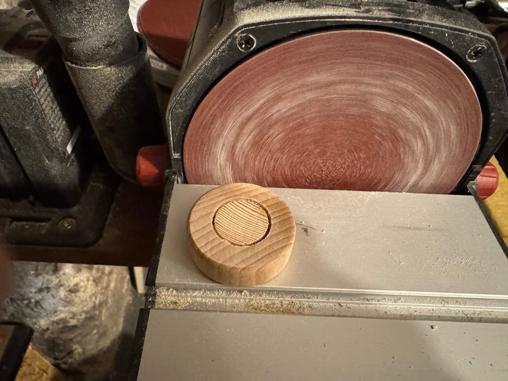

#### Dann den breiteren mit dem schmaleren Ex-Korken verleimen:

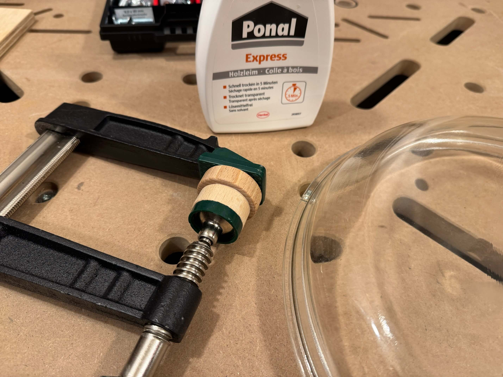

#### Die Unterseite des Doppels muß bisschen hohl sein, weil im Glasdeckel in der Mitte 'ne Erhöhung (Verstärkung?) ist:

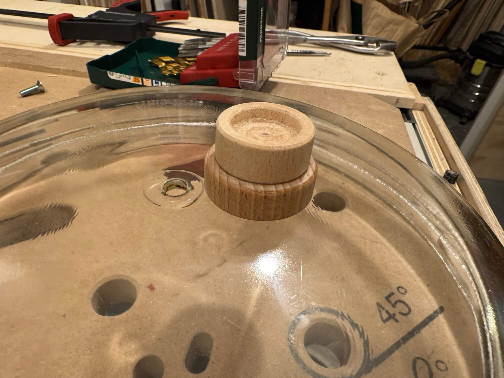

#### 5mm-Loch bohren:

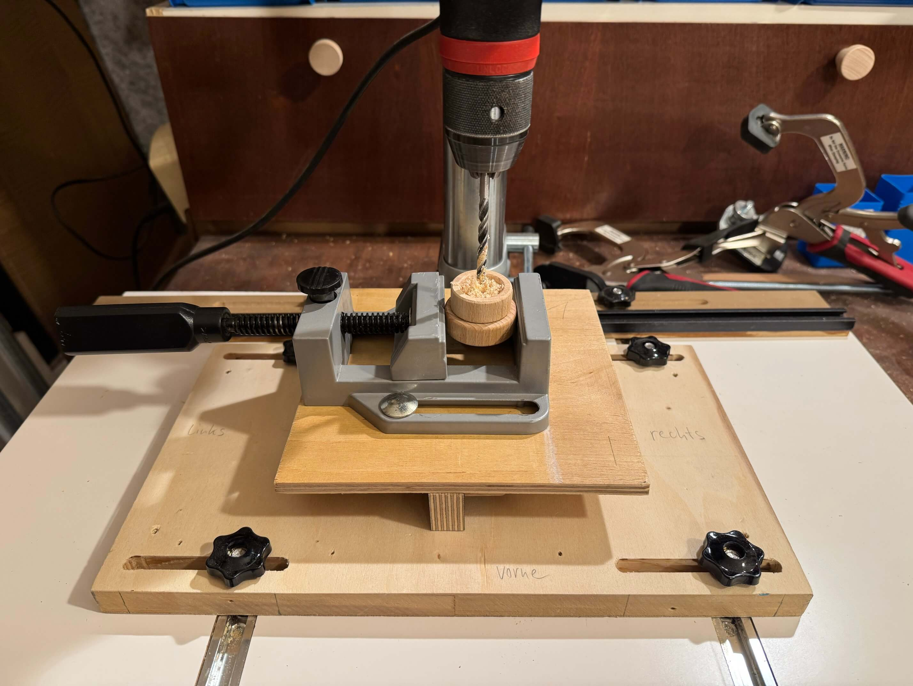

#### M6-Gewinde schneiden:

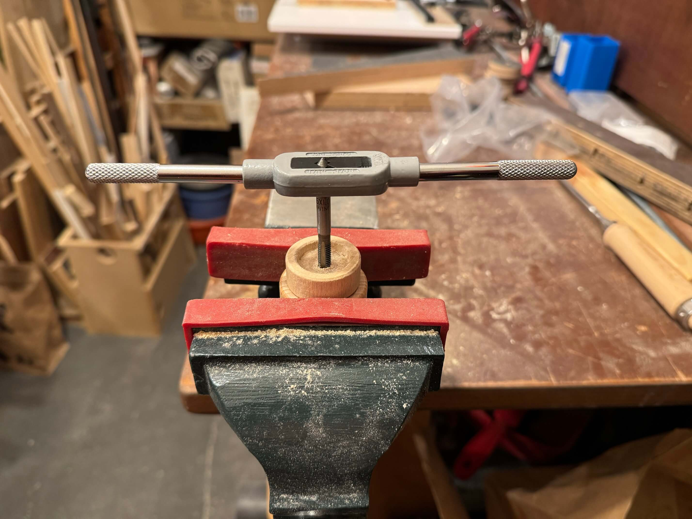

#### Holz zu weich also nochmal 8mm-Loch bohren...

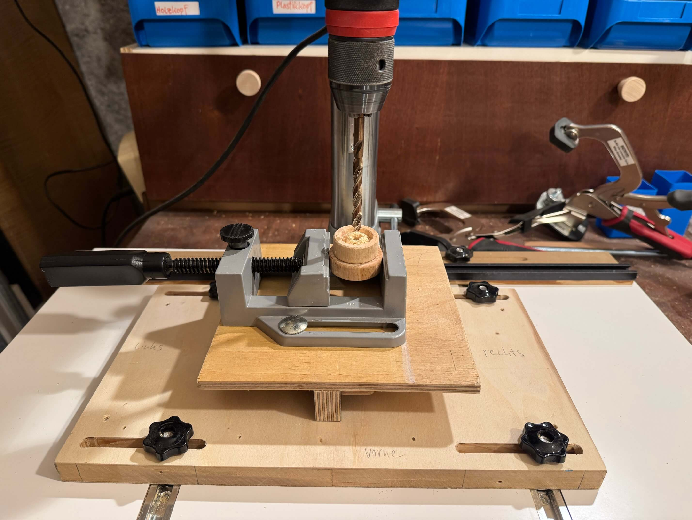

#### ...und mit Zentrierhilfe M6-Rampamuffe eindrehen:

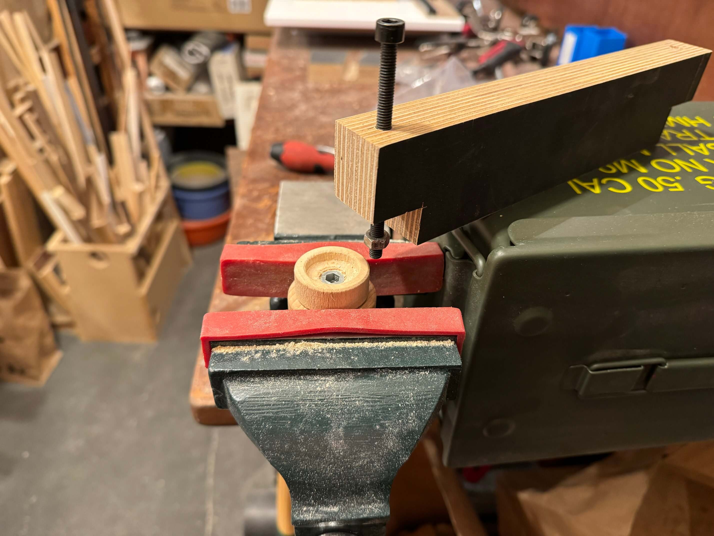

#### Mit rostfreier Edelstahlsenkkopfschraube fixieren:

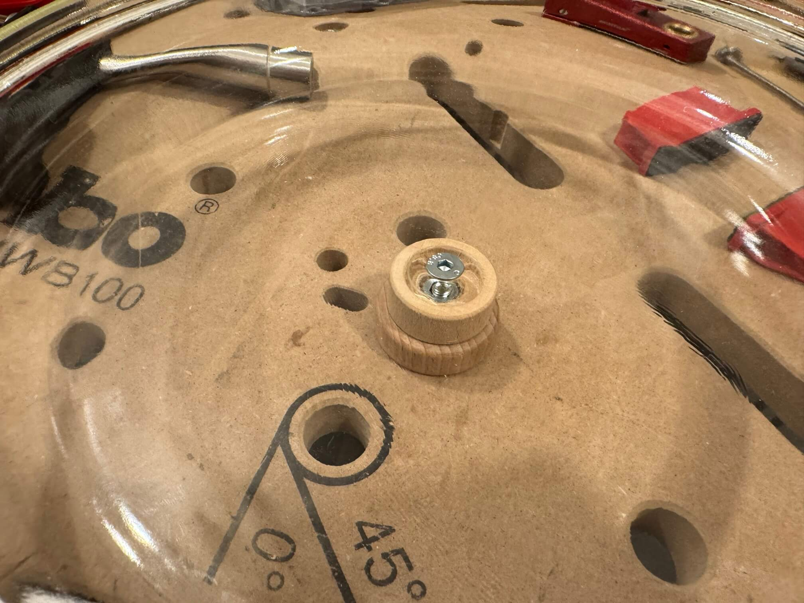

#### Sollte die nächsten Jahrzehnte wieder halten falls der Expressleim bisschen Hitze verträgt...

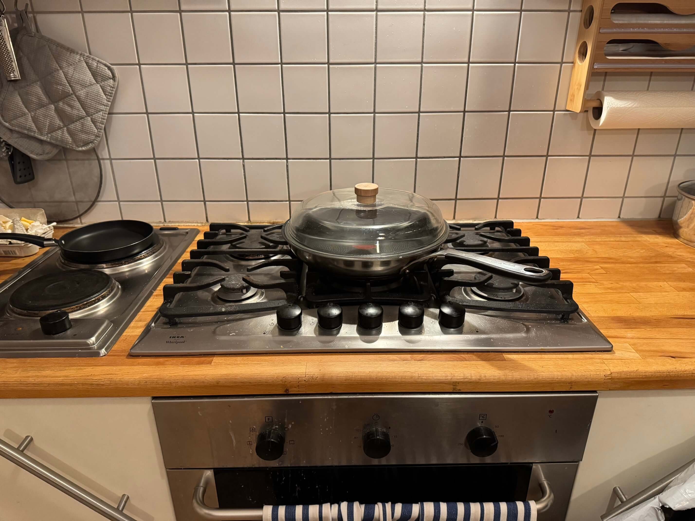
