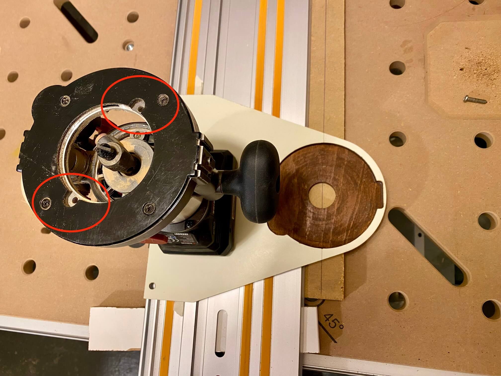

# Führungsschienenadapter für Oberfräse

Idee: da der mit der Parkside Akku-Multifunktionsfräse PMFAP 20-Li mitgelieferte Parallelanschlag ein Witz ist, Adapter für Führungsschiene bauen, um wiederholgenau mit Anschlag gerade fräsen zu können.

[Idee bei Peter Millard abgeguckt](https://www.youtube.com/watch?v=zzbS0yObBhk), der macht so nen Adapter aus Sperrholzblättchen und doppelseitigem Klebeband.

Aber das muß doch noch billiger gehen! ;)

Nach Begutachtung/Ausmessen der Abstände braucht es 6,5mm und zwei mal 6mm. Nur ein einziges kleines Sperrholzreststück in 6mm herumliegend, also das passend zugesägt, als oberste Schicht ein 3mm Schubladenboden aus dem letzten Jahrhundert.

#### Die ersten beiden Schichten verleimen:

#### 6,5mm starken Schrankrückwandrest aufleimen und die zweite 6mm-Schicht, die über die Führungsschiene überstehen wird und später direkt auf dem Werkstück aufliegt:

#### 6,5mm Schicht auf passende Breite zurechtfräsen:

#### Erstmal [Fräszirkel](../Kreisfraeser/README.md) bauen, um kreisrund 11mm tief in das Material zu fräsen, da ansonsten die Dicke der Vorrichtung 19mm betragen hätte, die bei der Frästiefe dann natürlich fehlt.

#### In gleicher Tiefe Aussparungen für den Oberfräskorb fräsen:

#### Außenkante in mehreren Tiefenschritten halbrund fräsen:

#### Mittelloch fräsen und dann mit Tauchsäge den Rest auf Format bringen:

#### Noch drei 8mm Löcher für Hammerkopfschrauben gebohrt, damit der Adapter sicher in der Zubehör-T-Nut geführt werden kann (ob eine Schraube mittig oder zwei an den Enden nötig/besser sind wird sich mit der Zeit herausstellen):

#### Holzschutz "Palisander" drauf pinseln (am Ende kommt noch ne Schicht Wachs auf die Unterseite, die später auf Schiene und Werkstück gleitet):

#### Nun Fräser exakt auf der angezeichneten Mittellinie ausrichten und 5mm-Löcher für die beiden M5-Gewinde an der Unterseite des Fräskorbs bohren:

#### "Überraschung"! Vorher nicht die Position der Löcher geprüft, eines ist jetzt dort, wo nur noch 2mm Materialstärke über der Schiene übrig sind, von daher kann man hier Senkkopfschraube vergessen <del>und stattdessen kommt ne 8er nur zum Positionieren rein</del>:

#### Schiene in Aktion, mit zwei losen Hammerkopfschrauben in der Zubehör-T-Nut:

#### Passt perfekt:

#### Da noch paar cm Alu-L-Profil rumlagen, einfach das Problem mit der einen M5-Schraube im Boden umgangen und eines der seitlichen M4-Gewinde stattdessen genutzt. Und noch einen Handknauf für bessere Führung des Gespanns draufgeschraubt/-klebt:

#### Mit Holzresten und Hammerkopfschrauben in der Zubehör-T-Nut können auch prima Anschläge realisiert werden, so dass die Länge der gefrästen Nuten auch wiederholgenau wird.

#### Lernerfolge:

  * Position der Bohrungen vorher prüfen, in dem Fall hätte es geholfen, den Fräskorb bisschen gedreht zu positionieren oder die ganze Vorrichtung 10mm breiter auszulegen, dann wären beide M5-Schrauben in 8mm Material gelandet und der Fräskorb hätte nur von unten mit der Vorrichtung verschraubt werden können
  * Falls sich die Vorrichtung als zu wenig präzise herausstellen sollte oder mit der Zeit mehr Spiel bekommt, evtl. Makita Oberfräsenmodul 195563-0 nebst passendem Führungsschienenadapter kaufen (kostet natürlich mehr als das ganze Set von Parkside)
  * Fräsen ohne vernünftige Absaugung und Atemschutz gefährdet die Gesundheit. Dringender Handlungsbedarf