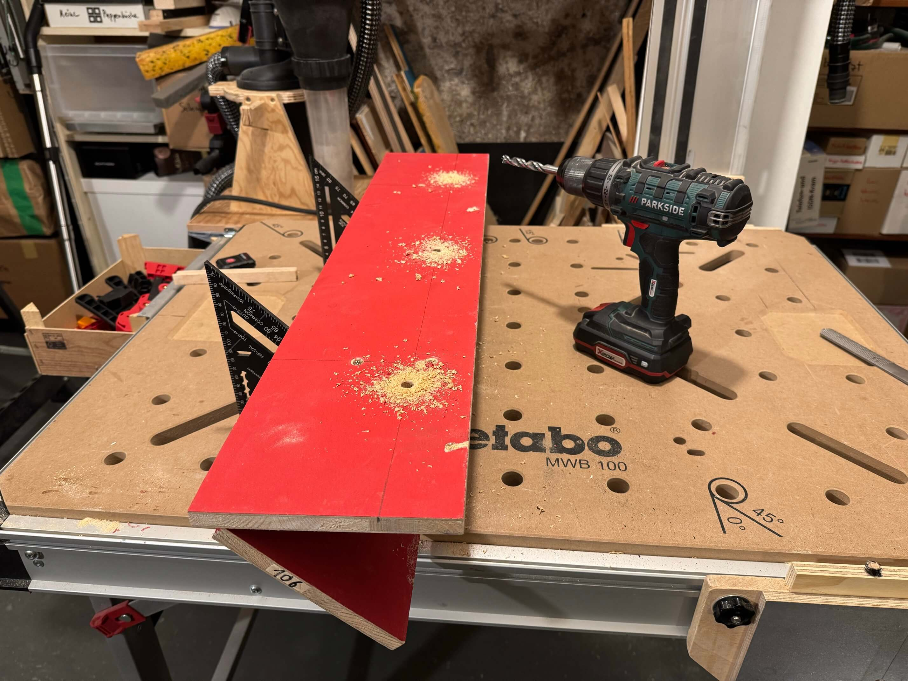

# Gehrungsschiene

Idee bei [Dominik Ricker geklaut](https://www.youtube.com/watch?v=4WEJXS8R0Jo). Er bemängelt bei seiner Festool-Tauchsäge Spiel, wenn sie auf 45° gestellt wird, meine Parkside-A1-Tauchsägen-Version scheitert schon an den 45° per se (kann nur 44,x° und die B2-Version, die bis 47° geht, ist grad eingeschickt zur Reparatur bei Grizzly Tools)

Teileliste:

  * Holz für lau von [Treibgut](http://treibgut-lager.de) (drum auch so schick bunt)
  * paar Schrauben
  * [3 x 30mm-Hammerkopfschrauben](https://www.temu.com/goods.html?_bg_fs=1&goods_id=601099579130694&sku_id=17592460585782)
  * 80cm Führungsschiene [von Temu (damals 18,50)](https://www.temu.com/goods.html?_bg_fs=1&goods_id=601099647544073)

#### Die Idee ist, zwei Bretter in perfektem 45°-Winkel zu verbinden und dann Führungsschiene an das schräge anzubringen. Trockentest:

#### Nun Dominik folgend keine 45°-Verbinder herstellen sondern kleinerer Winkel, damit am Ende exakt ausgerichtet werden kann (darum das Holzstück zwischen Bankhaken und Brett)

#### Verbindungselemente so gebaut, dass sie nicht direkt abschließen, damit Feinjustage möglich ist.

#### 45°-Winkel passt

#### Nun noch Anzeichnen der unteren T-Nut der Schiene

#### Dann kommen drei 8mm-Löcher rein ...

#### ... um die Hammerkopfschrauben aufzunehmen, die jetzt die exakte Schienenpositionierung sicherstellen

#### Erster Test passt, viel besser als alles, was bislang durch Winkelverstellung an den Parkside-Tauchsägen möglich war

