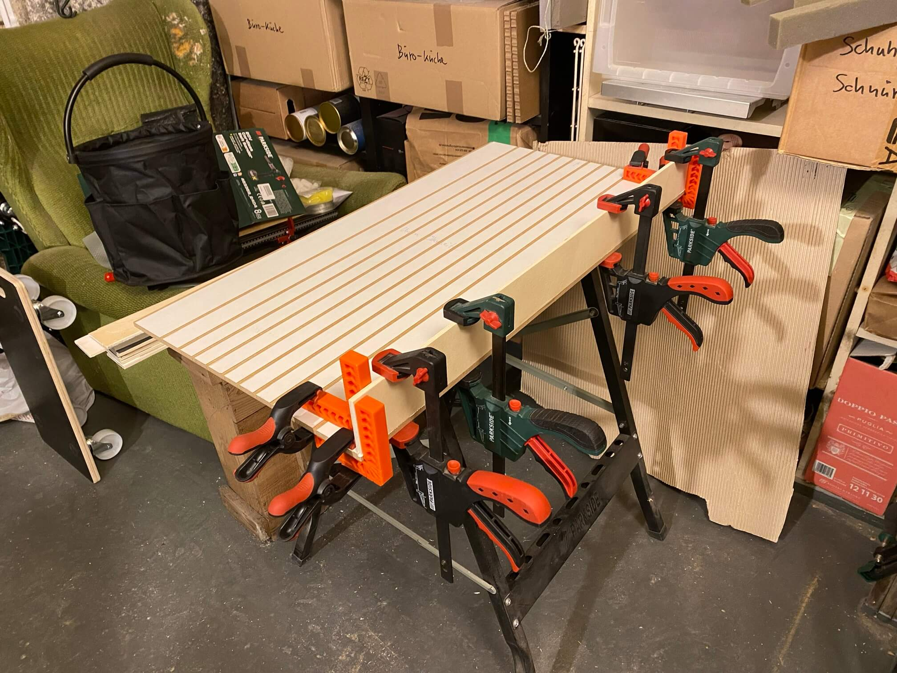

# Aufbewahrung von Gewindestangen & Co.

Idee: Um Gewindestangen/Latten/Leisten platzsparender verstauen zu können, eine Art "Einlage" fürs Schwerlastregal bauen mit 14 schmalen und 8 breiteren Fächern. Ursprünglich doppelstäckig geplant und nur verleimt nach Realitätsabgleich auf einstöckig reduziert, weil das nie im Leben verleimbar gewesen wäre:

Material (9mm HPL-Platten und 6mm Sperrholzreste) wie üblich für lau von [Treibgut](http://treibgut-lager.de). Alle Fächer 58mm hoch, die mittleren 24mm breit, die äußeren 34mm und 60mm.

#### Zu dem Zeitpunkt noch doppelstöckig geplant, also drei horizontale Elemente anzeichnen:

#### Nun mittels [Klappschiene](https://github.com/ThomasKaiser/Basteln/tree/main/media/Klappschiene#readme) und [Fräsadapter](https://github.com/ThomasKaiser/Basteln/blob/main/media/Fraesschiene/README.md) 1mm tief und 6mm breit ins HPL fräsen, in der Hoffnung, später sauber verleimen zu können:

#### Selbes Spiel auf der anderen Seite:

#### Nun Sperrholzreste per Anschlag in exakt 60mm breite Streifen sägen:

#### Alles Material beisammen. Man sieht schon, dass die Sperrholzbrettchen ein Eigenleben führen und erster Stecktest ergab, dass 6mm Brett in 6mm Nut auf 82cm Länge nicht funktioniert (viel zu eng), also musste beim Sperrholz jede Kante angefast werden.

#### Verleimung schrittweise von außen nach innen. Ein ziemlicher Aufriß, das gerade hinzubekommen und gar nicht dran zu denken, Ober- und Untereite gleichzeitig festzuleimen. Also wird nur unten verleimt:

#### Das sind die letzten beiden Trenner, die noch individuell verleimt werden:

#### Die letzten sechs mittleren Trenner können sauber in den Nuten positioniert und am Stück verleimt werden:

#### Wochen später nach Ausflug zu [Poolhäuschen](https://github.com/ThomasKaiser/Basteln/blob/main/media/Poolhaus/README.md) und [Rampe](https://github.com/ThomasKaiser/Basteln/blob/main/media/Rampe/README.md) Ergebnis prüfen. Passt!

#### Deckel drauf, je Trenner drei Nägelchen reinschießen und fertig. Den Rest erledigt eh die Schwerkraft, da Werkzeugkoffer drauf kommen:

#### Es kann eingeräumt werden:

