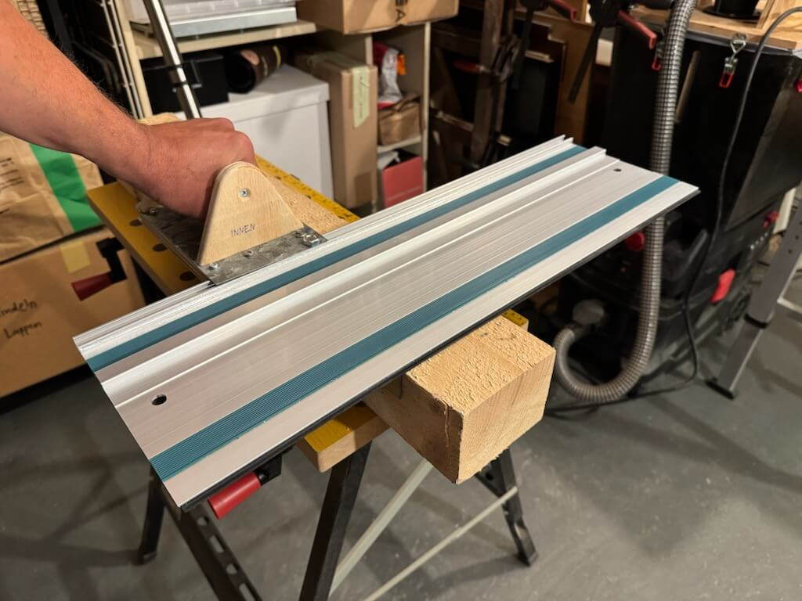
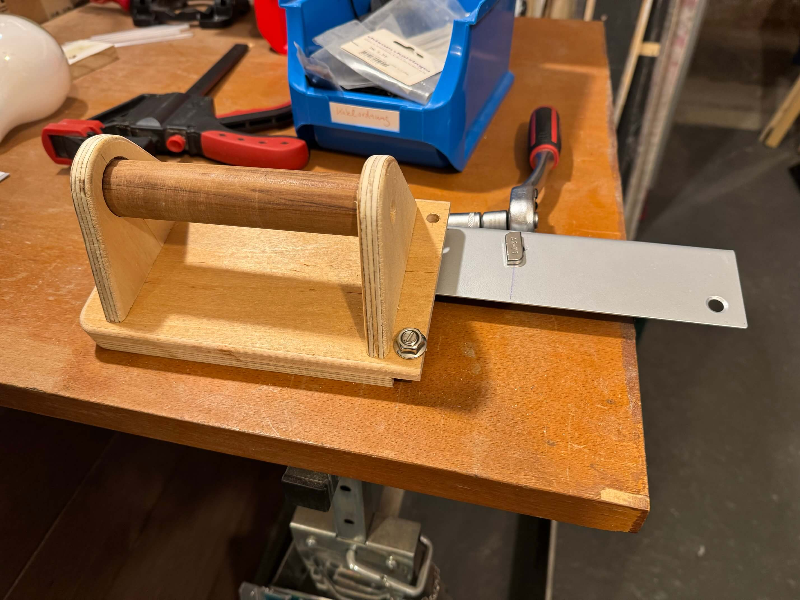

# Kappschiene

Aufgabenstellung: In Ermangelung einer Kappsäge die [Kappschiene KS450 von Youtool](https://www.youtool.de/epages/0c1502f0-2260-469b-9d8e-7af47a46af8a.sf/de_DE/?ObjectPath=/Shops/0c1502f0-2260-469b-9d8e-7af47a46af8a/Products/KS450) nachbauen. Idee dahinter ist, mit Tauch- oder Handkreissäge flott, präzise und ungefährlich Kappschnitte anfertigen zu können. Umsetzung beim ersten Versuch lala, seit Nachbesserung (Griff 9cm nach vorne verlegt) aber OK. Und mit zweiter Iteration, die auch mit meinen Tauchsägen kompatibel ist, prima (die erste Version geht an nen Spezl, der ne Festool TS 55 hat)

#### Das Original:

#### V1.1 des Nachbaus nach Griffkorrektur:

#### V2 des Nachbaus nun deutlich flacher über der Zubehör-T-Nut:

#### Erster Schritt: 12mm und breiteres 8mm Multiplex so zusammenleimen, dass Griffauflage entsteht, die mit Metall-L-Profil (keine Ahnung wo das herkam? Nachbarin und Küchenrenovierung?) verbunden wird, das den Anschlag darstellt. Kanten mit der Oberfräse abgerundet:

#### L-Profil kürzen. Dazu Trennscheibe mit Reduzierring in die Tauchsäge und bequem an der Klappschiene ablängen:

#### Erster großer Fehler: Holz und Aluprofil mit 2K-Kleber zusammengepappt aber falsche Kante als Referenz. Als Resultat wird der Griff zu weit weg vom Werkstück sein:

#### Nun 4 Löcher bohren, 4 Gewinde in Alu/Holz schneiden und olle Schrauben aus altem Fahrrad reindrehen für sicheren Halt:

#### Zweiter Fehler beim 2K-Zusammenkleben: keine Hammerkopfschraube in oberem Loch mehr anzubringen. Jetzt 10er Loch durchs Alu bohren, damit am Ende zwei Hammerkopfschrauben Schiene und Kapptool verbinden können (eine von oben, eine von unten):

#### Nun Griff anfertigen: in die Seitenteile mit 30er Forstnerbohrer paar mm Vertiefung bohren:

#### Mit der Oberfräse die Kanten abrunden:

#### Seitenteile mit Tauchsäge getrennt, Besenstielabschnitt und Seitenteile auf Verschrauben vorbereiten:

#### Konstruktion quasi fertig, zwei Hammerkopfschrauben (pro T-Nut eine oben/unten) warten darauf, die Schiene aufzunehmen:

#### Überraschung! Tauchsäge passt nicht zum Konstrukt, weil sie nur ca. 6 mm "Bodenfreiheit" über der Zubehör-T-Nut verträgt:

#### Vorher extra wegen Tauchsäge noch "Nebenprojekt" an der Klappschiene, um die vier 60cm-Schienen, die für kleines Geld bei [Kpxin](https://www.temu.com/de/kpxin-m-5895206725547.html?goods_id=601101123161584) bestellt wurden, mit der Tauchsäge kompatibel zu machen:

#### Die Kpxin-Schienen sind Makita-kompatibel also mit zusätzlicher Nut, um Kippeln bei Gehrungsschnitten zu verhindern. Die Nut muß weg sonst passt die Tauchsäge nicht auf die Schiene. Links vorher, rechts nachher:

#### Nun erster Test mit 40V-Handkreissäge (die ist schmäler als meine Tauchsägen und hat mehr "Bodenfreiheit", d.h. passt auf die Konstruktion) an 60mm starkem Balken:

#### Ergebnis nicht wirklich rechtwinklig:

#### Also beide Hammerkopfschrauben lösen, Schreinerwinkel in Stellung bringen und die Konstruktion perfekt ausrichten!

#### Update 1: Griff neu gebaut, 9cm weiter "vorne" erleichtert die Handhabung deutlich:

#### Update 2: neue v2-Version bauen, die kompatibel zu meinen Tauchsägen ausfällt, d.h. deutlich flacher werden muß, weil Tauchsäge nur ca. 6mm Abstand über der Zubehör-T-Nut verträgt. Diesmal werden 12 mm Holz mit 1 mm Metall verbunden. Kellerfund (Bodenschutzblech für Kohleöfen) mit Trennscheibe in Tauchsäge an Schiene auf Format bringen:

#### Zweites noch herumliegendes L-Profil an Schiene kürzen:

#### Evaluieren, ob das Setup auch für die fetten Parkside-Akkus mit 8 und 12 Ah tauglich sein soll aber dann dagegen entschieden, weil das in zu schmalem Griff geendet hätte:

#### Metall und Holz wieder mit 2K-Zeugs zusammengeklebt aber jetzt für sicheren Halt noch mit 4,5er Bohrer sechsmal vorbohren, dann M5-Gewinde reinschneiden und mit Fahrrad-"Schrott" Metall und Holz verbinden:

#### 20mm-Hammerkopfschraube muß gekürzt werden, damit Tauchsäge genug "Bodenfreiheit" hat. Mit 6,5er Bohrer in Holzabschnitt vorbohren, 8mm-Gewinde reinschneiden, Hammerkopfschraube reindrehen und bequem an der Klapptschiene mit Trennscheibe ablängen:

#### Der obsolete Griff der v1-Variante braucht neue Bohrlöcher an der v2, weil insgesamt flacher und damit müssen die 60mm-Schrauben mehr in die Mitte wandern:

#### Unterseite der v2-Konstruktion:

#### V1.1 und V2 im Vergleich. Der Griff der 1.0-Version ist schmäler an die V2 gewandert und die V1.1 versucht mit vorgelagertem Griff den dummen Fehler der Verbindung Anschlag und Griffauflage zu kaschieren:

#### Lernerfolge:

  * Vorher Dimensionen prüfen statt blind drauf zu vertrauen, dass die Säge schon nicht über die Zubehör-T-Nut ragt
  * da schon wieder Referenzkante vergeigt Markierungssystem adaptieren, um solchen Quatsch in Zukunft zu vermeiden
  * Bedingt durch die falsche Griffposition der 1.0 fühlt sich das Werkeln mit der Handkreissäge unpräzise an, weil man leicht verrutscht, wenn man die Säge an der Schiene entlang nach vorne schiebt. Mit Tauchsäge sicherlich weniger ein Problem, da man eben ins Werkstück eintauchen kann.
  * Wenn man mit nagelneuen Führungsschienen Nuten abtrennt wie oben, dann empfiehlt es sich, die ganze Schiene sauber abzukleben, da die eingeklebten Gummi-Gleistreifen sonst die Aluspäne kraft Kleber an den Rändern konservieren. Das Problem hat man mit bereits genutzten Schienen nicht, da dort durch Sägespäne & Co. der ganze Kleberüberstand neutralisiert wurde
