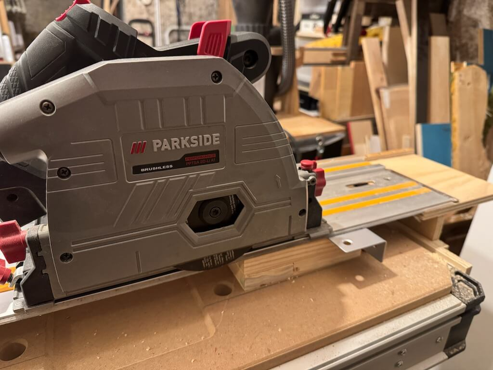

# Kappschiene

Aufgabenstellung: In Ermangelung einer Kappsäge die [Kappschiene KS450 von Youtool](https://www.youtool.de/epages/0c1502f0-2260-469b-9d8e-7af47a46af8a.sf/de_DE/?ObjectPath=/Shops/0c1502f0-2260-469b-9d8e-7af47a46af8a/Products/KS450) nachbauen. Idee dahinter ist, mit Tauch- oder Handkreissäge präzise und ungefährlich Kappschnitte anfertigen zu können. Umsetzung leider nur so lala.

#### Das Original:

#### Erster Schritt: 12mm und breiteres 8mm Multiplex so zusammenleimen, dass Griffauflage entsteht, die mit Alu-L-Profil (keine Ahnung wo das herkam? Nachbarin und Küchenrenovierung?) verbunden wird, das den Anschlag darstellt. Kanten mit der Oberfräse abgerundet:

#### Alu-Profil kürzen. Dazu Trennscheibe mit Reduzierring in die Tauchsäge und bequem an der Klappschiene ablängen:

#### Erster großer Fehler: Holz und Aluprofil mit 2K-Kleber zusammengepappt aber falsche Kante als Referenz. Als Resultat wird der Griff zu weit weg vom Werkstück sein:

#### Nun 4 Löcher bohren, 4 Gewinde schneiden und olle Schrauben aus altem Fahrrad reinschrauben für mehr Stabilität:

#### Zweiter Fehler beim 2K-Zusammenkleben: keine Hammerkopfschraube in oberem Loch mehr anzubringen. Jetzt 10er Loch durchs Alu bohren, damit am Ende zwei Hammerkopfschrauben Schiene und Kapptool verbinden können:

#### Nun Griff anfertigen: in die Seitenteile mit 30er Forstnerbohrer paar mm Vertiefung bohren:

#### Mit der Oberfräse die Kanten abrunden:

#### Seitenteile mit Tauchsäge getrennt, Besenstielabschnitt und Seitenteile auf Verschrauben vorbereiten:

#### Konstruktion quasi fertig, zwei Hammerkopfschrauben warten darauf, die Schiene aufzunehmen:

#### Überraschung! Tauchsäge passt nicht zum Konstrukt, weil sie nur paar mm "Bodenfreiheit" über der Zubehör-T-Nut verträgt:

#### Vorher extra wegen Tauchsäge noch "Nebenprojekt" an der Klappschiene, um die vier 60cm-Schienen, die für kleines Geld bei [Kpxin](https://www.temu.com/de/kpxin-m-5895206725547.html?goods_id=601101123161584) bestellt wurden, mit der Tauchsäge kompatibel zu machen:

#### Die Kpxin-Schienen sind Makita-kompatibel also mit zusätzlicher Nut, um Kippeln bei winkligen Schnitten zu verhindern. Muß weg die Nut. Links vorher, rechts nachher:

#### Nun erster Test mit 40V-Handkreissäge an 60mm starkem Balken:

#### Ergebnis nicht wirklich rechtwinklig:

#### Also beide Hammerkopfschrauben lösen, Schreinerwinkel in Stellung bringen und das Setup perfekt ausrichten!

#### Lernerfolge:

  * Vorher Dimensionen prüfen statt blind drauf zu vertrauen, dass die Säge schon nicht über die Zubehör-T-Nut ragt
  * da schon wieder Referenzkante vergeigt Markierungssystem adaptieren, um solchen Quatsch in Zukunft zu vermeiden
  * Bedingt durch die falsche Griffposition fühlt sich das Werkeln mit der Handkreissäge unpräzise an, weil man leicht verrutscht, wenn man die Säge an der Schiene entlang nach vorne schiebt. Mit Tauchsäge sicherlich weniger ein Problem, da man eben ins Werkstück eintauchen kann. Wahrscheinlich geht dieser Prototyp an nen Spezl, der mit Festool-Tauchsäge am Start ist, und ich baue mir ne zweite Variante mit Griffauflage aus dünnem Metall für meine Tauchsäge(n).
