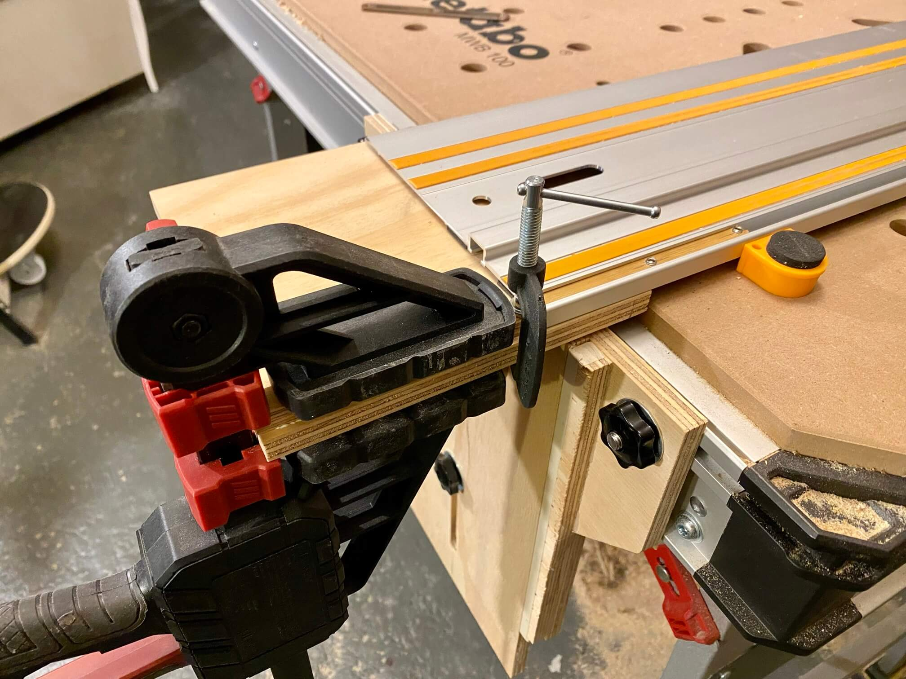

# Führungsschiene in exakt und wegklappbar

Idee wie üblich bei [Peter Millard](https://www.youtube.com/watch?v=sHj5G6t1qvY) geklaut. Warum das mit klappbarer Schiene und vor allem flexiblem Anschlag so wichtig ist, bei [Guido Henn](https://www.youtube.com/watch?v=EbhWwJawMe0).

Hier bestand aber die Herausforderung 80cm-Führungsschiene an 75cm Tischtiefe zu betreiben ergo musste Peters Vorderteil "falsch herum" gebaut werden. Das verstellbare Brettchen ist innen und nicht außen angebracht. Daher sind die Außenteile 13mm stark, damit sich das 12mm-Brettchen dazwischen auf und ab bewegen kann.

Material Kellerfunde und die 12mm Sperrholzbrettchen von [Treibgut](http://treibgut-lager.de/).

#### Einzelteile des Vorderteils formatiert, vorgebohrt und die fixen Teile verleimt:

#### Für das verstellbare Brett Nut für Hammerkopfschraube gefräst und eingeklebt

#### Nun Langloch in die fixe Befestigung fräsen – bequem an der Schiene mit Anschlägen:

#### Nun noch 8mm Loch in das verstellbare Brettchen bohren, Holzdübel rein und fertig ist die Schienenfixierung:

#### Mit dem Hinterteil selbes Prozedere: formatieren, zusammenleimen/nageln:

#### Nut für Hammerkopfschraube fräsen, Schraube einkleben, Langloch fräsen:

#### Mit Zentrierbohrer Position der Schrauben fürs Scharnier markiert:

#### Mit der Schruppscheibe flott überstehende Schraubenspitzen nivelliert:

#### Fitting-Test um die finalen Abstände hier und da zu bestimmen:

#### Aus 5 Hartholzkeilen und Reststück Schreibtischschubladenseitenteil Scharnierhalterung für das höhenverstellbare Brettchen zusammenleimen:

#### 1,5 mm Material wegfräsen auf 12 cm:

#### Das Ganze wird ein 12mm breites Leistchen, in das zwei Gewinde für Madenschrauben geschnitten werden, das in die Zubehör-T-Nut-Schiene geschoben wird. 

#### Alles exakt ausrichten und verleimen:

#### Der Scharnieraufbau wird mit 6 Schrauben verstärkt:

#### Die andere Seite vor dem Verschrauben:

#### Mit Zentrierbohrer Bohrlöcher für diesen Kellerfund markieren, der später die Schiene in der Vertikalen stützen wird:

#### Abstandshalter verleimen, damit die Schiene später nicht zu schief in der Luft steht:

#### Vorder- und Hinterteil praktisch fertig:

#### Mit Bankhaken exakt ausrichten, dann an beiden Seiten mit den Sternkopfschrauben an die T-Nuten des Tisches knallen:

#### Wenn Schiene nicht gebraucht wird, Vorderteil komplett runterfahren und Schiene aus dem Weg klappen:

#### Zwischen 5mm und 98mm einstellbar:

#### Erster Schnitt: Werkstück mit Bankhaken positioniert und Winkel exakt 90°:

#### Neue 120cm-Schiene von KPXIN endlich per Eisenbahn angereist und Klappvorrichtung auf Längsseite umgerüstet:

#### Dann eine Runde blöd schauen, weil die Schiene Makita-kompatibel ist so dass keine meiner Tauchsägen und auch der [Oberfräsadapter](../Fraesschiene/README.md) nicht passen:

#### Für 18€ nochmal die gelbe Schiene geschossen. Ist zwar eigentlich zu lang (dauernd Deckenlampe im Weg) aber was soll's:

