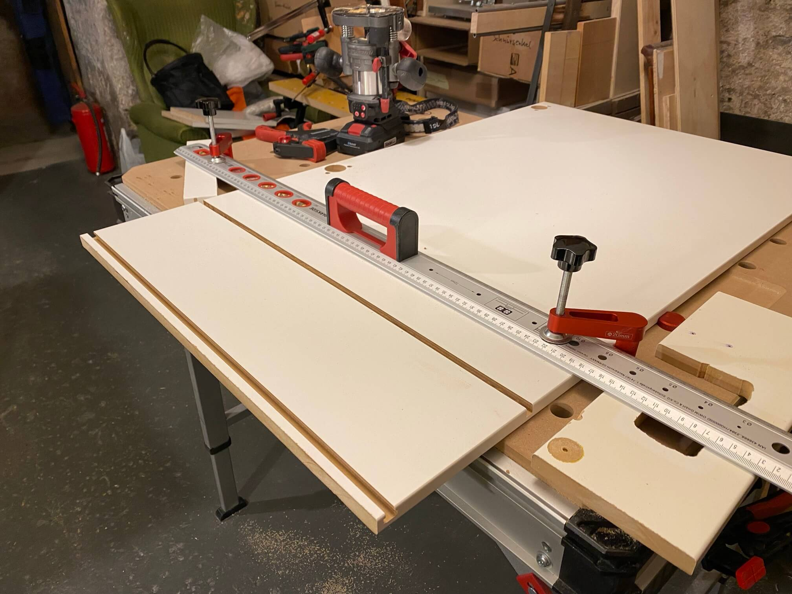
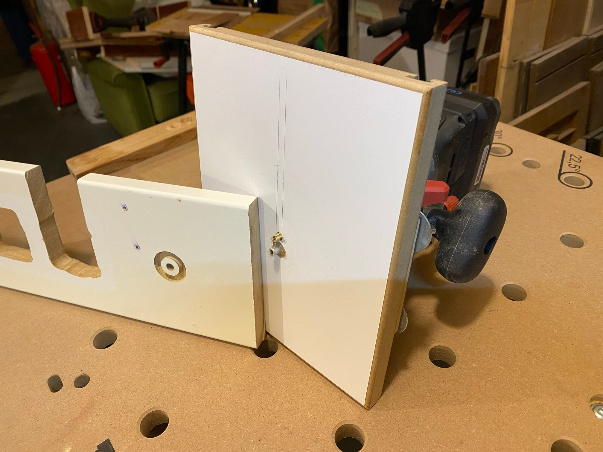

# Fräszirkel für kleine Durchmesser

Um den [Führungsschienenadapter für Oberfräse](../Fraesschiene/README.md) zu bauen bestand die Notwendigkeit (Halb-)kreise zu fräsen. Und das mit kleinem Durchmesser.

[Idee von Holzwerken](https://www.youtube.com/watch?v=sUedGF2HmPA), die das mit ordentlichem Oberfräskorb auf HPL-Platte gelöst haben:

Da kein passender Fräskorb im Einsatz, die Idee, das aus Rest-Stücken mit T-Nut-Adaptern auf einem Abschnitt IKEA-Küchentür zu bauen, weil Material glatt beschichtet, was sicher von Vorteil ist.

#### Erstmal zwei parallele T-Nuten in das MDF fräsen. Mit 8er Nut beginnen, dann T-Nut-Fräser den Rest erledigen lassen:

#### Dann "Schiene" ablängen und zweiteilen, denn es sollen zwei Fräszirkel werden: ein handlicher für Durchmesser von 22 - 90 mm und der andere Abschnitt dann für Durchmesser bis 35cm:

#### Versuch, ein 20mm breites "Langloch" zu erstellen. "Überraschung": MDF ist das falsche Material dafür, denn wenn man punktuell Druck ausübt, zerbröselt das Ganze. Ist halt doch eher Pappe als Holz.

#### Falls der längere Abschnitt doch noch gebraucht werden sollte, kann man das mit gefrästem Falz und 19er-Alu-T-Nut-Schiene an jeder Seite noch retten.

#### Jetzt geht es daran, T-Nut-Adapter für die M4-Gewinde des Fräskorbs zu bauen:

#### 1,5mm Falz in Schrankrückwandrest fräsen und dann mit Resten von Alu-L-Profil zusammenpappen (mit 2K-Kleber – Profil natürlich 1,5mm stark):

#### Weitere L-Profil-Reste mit Winkelschleifer und Opferholz um 1,5mm kürzen, damit es später nicht übersteht:

#### Passt perfekt, nun erneut mit 2K-Kleber zusammenpappen:

#### Noch 5mm-Löcher für Anbringung an Fräskorb und 8mm-Löcher bohren für Hammerkopfschrauben, die in der T-Nut geführt werden:

#### Fertig ist die Vorrichtung und fräst tatsächlich saubere Kreise mit stufenlos einstellbarem (und eben auch sehr kleinem) Durchmesser:

#### 6mm Zentrierpin ist Abschnitt eines Aluröhrchens, das herumlag.

#### Nun als zweite Übung für den [Führungsschienenadapter](../Fraesschiene/README.md) Vertiefung mit 123mm Durchmesser fräsen als auch Mittelloch und Teile des Randes:

#### Fürs Mittelloch ausfräsen immer drandenken, dass der finale Fräsvorgang mit voller Tiefe mit zusätzlichem Zentrierpin von der Unterseite her erfolgen muß, sonst haut die Fräse ab.

#### Lernerfolge:

  * MDF eher Scheize für sowas, weil zerbröselt leicht
  * Die Variante mit der IKEA-Tür dumm gewesen, da die Plattenstärke von 16mm natürlich bei der Frästiefe fehlt. Unter Beibehaltung der gebauten T-Nut-Adapter könnte das auf 8mm verbessert werden: Langlöcher vertikal ins Alu, 19er-Alu-T-Nuten mit 2K-Kleber an 8mm HPL-Platte ankleben
  * Die kwb-Bohrlehre ist nicht geeignet für wirklich präzise Positionierung. Besser mit dem Ding Schablone vorbohren, dann Schablone exakt auf Werkstück positionieren und die eigentlichen Löcher bohren
  * Fräsen ohne vernünftige Absaugung und Atemschutz gefährdet die Gesundheit. Dringender Handlungsbedarf