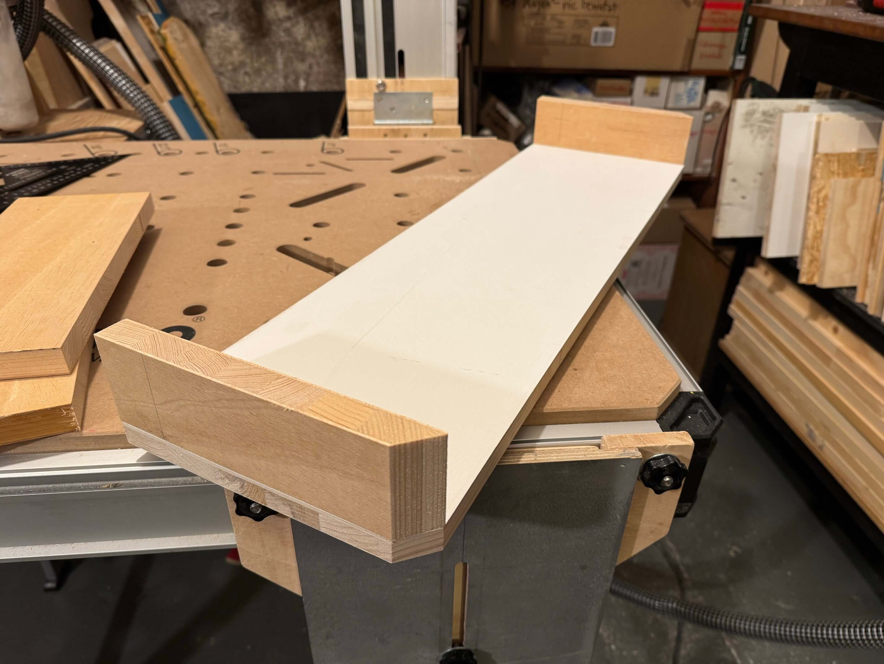
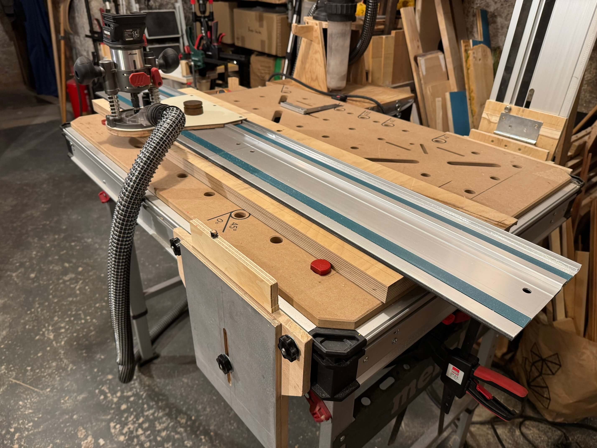

# MWB100-Verbreiterung

Da ich ungern direkt in die Werkbank reinsäge und rechts neben der Klapptschiene mehr Platz brauche, um an der Schiene zu fräsen, kam die Idee, das Ding zu verbreitern. Aber so, dass der Anbau auch abgenommen und trotzdem perfekt justiert werden kann, um eine völlig plane optionale Verlängerung bereitzustellen.

Sieht am Ende dann so aus mit T-Nuten ringsum, um die Klappschiene oder anderes Zeugs zu befestigen und wechselbarem Opferstreifen in der Mitte, in den ca. 12mm tief hineingesägt werden kann:

#### 1. Schritt 19mm starke Tischlerplatte auf Maß bringen (75x23,x cm) und dann Ecken abschrägen, um die Optik des MWB100 fortzuführen:

#### Seitenteile wegen abgeschrägter Ecken auf Gehrung sägen:

#### Ergebnis nicht perfekt aber gut genug:

#### Reststück Vidga-Vorhangstange zurechtschneiden für die kurzen T-Nuten:

#### 19mm-T-Nut ablängen für die lange Seite:

#### Passt alles soweit:

#### Kurze T-Nuten mit Hammerkopfschrauben an Brettchen anbringen, die von oben verschraubt sind:

#### In die lange Seite Falz fräsen zur Aufnahme der T-Nut:

#### T-Nut verkleben/verschrauben:

#### Alle Teile verleimen/verschrauben:

#### So sieht's dann richtig herum aus:

#### Um die Außenkante des Anbaus präzise stützen zu können, Reckstange aus Jugendtagen einfach halbiert, um die mit Lattenabschnitten zu kombinieren, in die 5-6cm tiefe Löcher für die Stange gebohrt werden:

#### Wurde dann eine filigranere Latte und das Ergebnis ein wenig schief:

#### Stellte sich am Ende aber als Vorteil heraus, weil durch Drehen der Latte um 180° simple Winkelkorrektur möglich:

#### Für die Befestigung an der Innenseite mit 3 Hammerkopfschrauben in der T-Nut des MWB100 braucht es Vertiefungen, um mit der Ratsche ranzukommen:

#### Nun noch 3 Reststücke sehr hartes Muliplex zurechtsägen und Aussparungen dafür ausfräsen:

#### Anschließend zusammenleimen/schrauben:

#### Für die Aufnahme der Reckstangen unterhalb des Anbaus mit Lochsäge "Schuhe" bohren:

#### Anschließend mit abgeschrägten Klötzen und Oberseite verleimen/verschrauben und nun fertig zur Montage:

#### Tischseitig alles wunderbar. Ratsche hat Platz und die Schrauben genügend Spiel für Feinjustage:

#### Die Reckstangen können jetzt präzise durch Drehen in der Höhe so justiert werden, dass der Anbau völlig plan zum MWB100 ist:

#### Noch 20x13mm-Opferstreifen gesägt und mit Spielzeughobel zwischen MWB100 und Anbau eingepasst:

#### Erste Aufgabe des neuen Setups: exakt identische 12x12cm-Quadrate sägen für den Bohrtisch:

