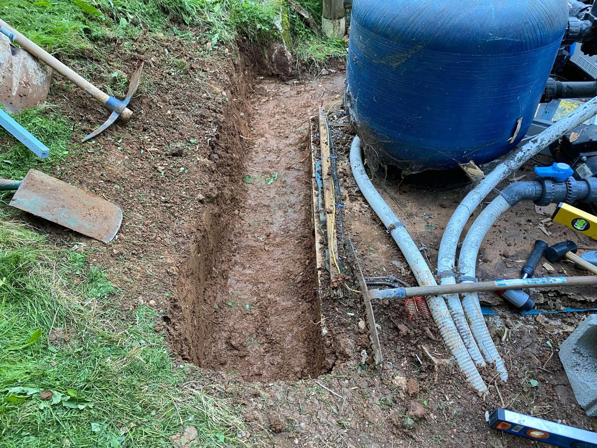
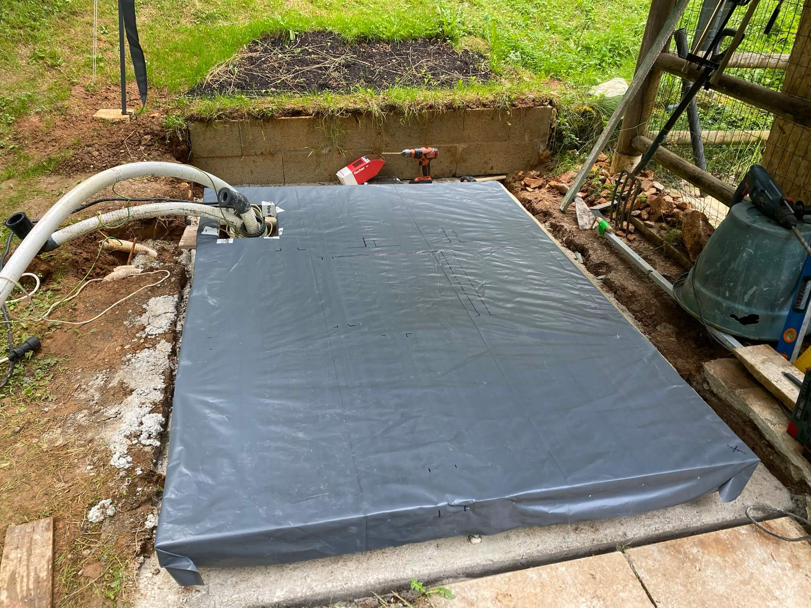
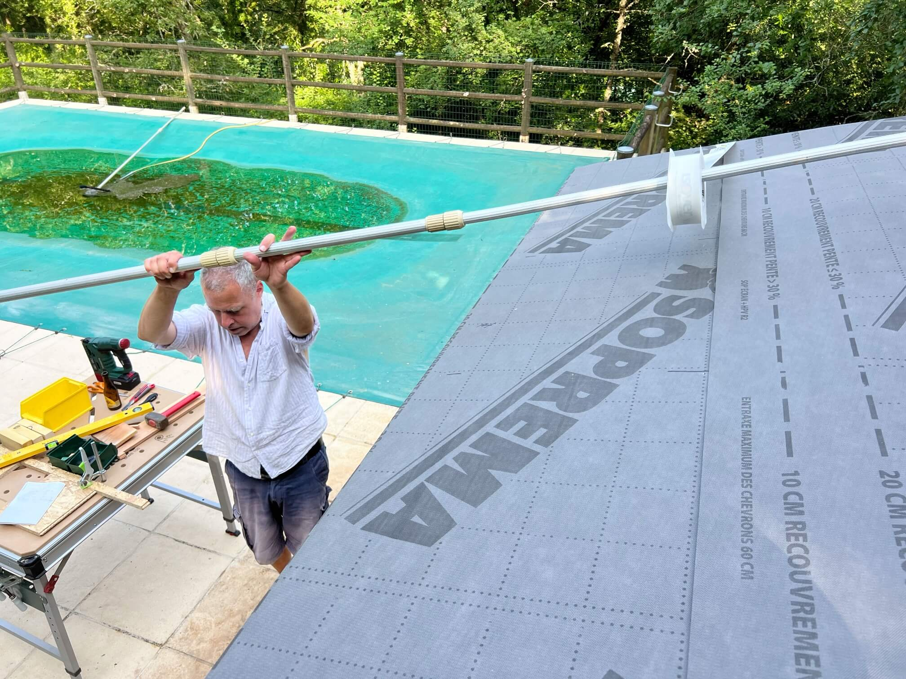
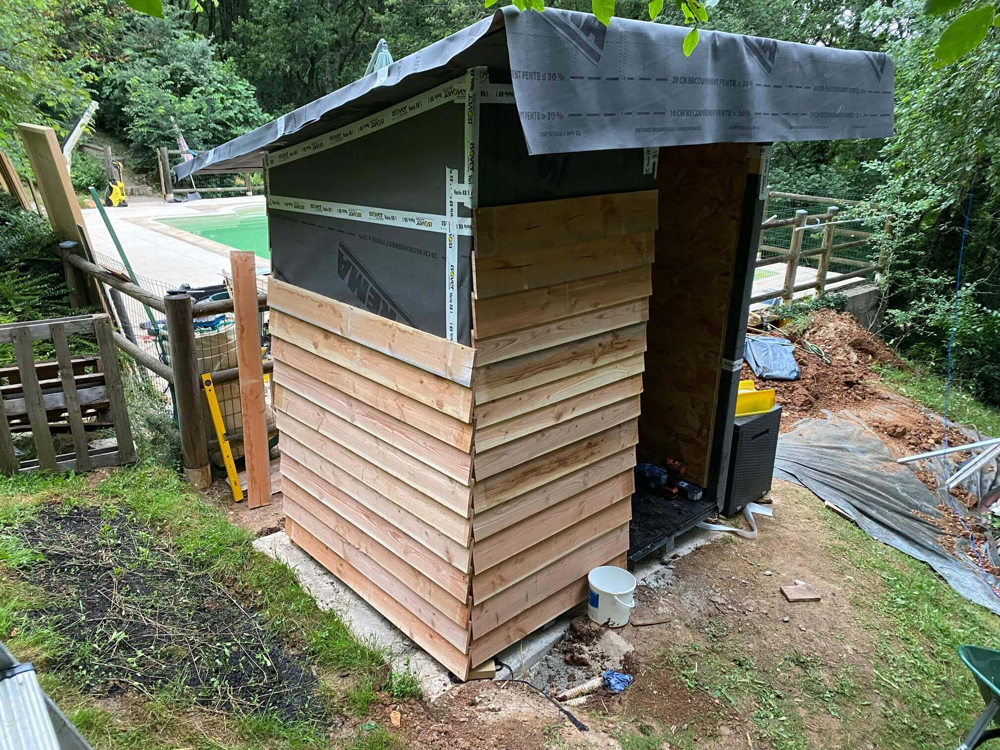
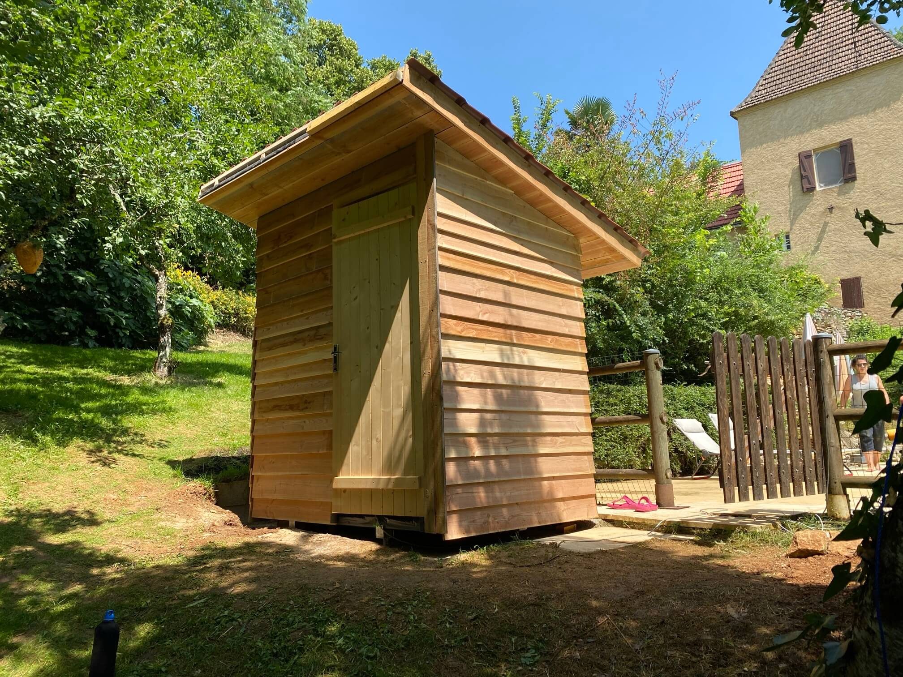

# Poolhäuschen

Aufgabenstellung: _nicht_ schallgedämmtes, altes und nahezu verrottetes Poolhäuschen abreißen und neues bauen, das leiseren Pumpbetrieb ermöglicht, haltbar(er) ist, zusätzlich Platz für Rasenmäher und Pool-Putzroboter bietet und nicht so Scheize aussieht wie das alte:

#### Das alte Häuschen enthielt Pumpe, mit Sand gefüllte Filtertonne und Elektrik, ist laut und kurz vorm Auseinanderfallen:

#### Abriß und das angeschimmelte Holz ab zum Wertstoffhof

#### Der Starkregenschutz in Form eines künstlichen Hügelchens hat offensichtlich nicht funktionert: Bodenplatte komplett verfault:

#### Ergo Hügel abtragen und anfangen, Böschungsmauer zu bauen:

#### 

#### 

#### Herumliegenden Bewehrungstahl anspitzen und durch Löcher in der Böschungsmauer in Lehmboden hauen:

#### 

#### Lehm anfeuchten, wieder auffüllen, verdichten und dann mit vorher ausgestochener Grasnarbe soweit möglich bedecken:

#### 

#### Auf die offenen Stellen noch bisschen Torf drauf, um das Anwachsen zu beschleunigen (der Lehm hier hat Ziegelqualität und wird im Sommer steinhart)

#### Betonfundament folgt, erstmal Rampen bauen, damit die sieben Schubkarrenladungen von der Einfahrt ca. 100 Meter entfernt und 10 Höhenmeter tiefer unfallfrei ankommen:

#### Schnelles Nebenprojekt: Aus den Schalungsbrettern und [den Resten vom Rampenrundholz](https://github.com/ThomasKaiser/Basteln/blob/main/media/Rampe/README.md#rundholz-peu-à-peu-abrunden-und-ablängen) zwei Kästen zur Aufhängung von Schraubzwingen bauen, die an die Wand gehängt oder bequem herumgetragen werden können:

#### Nun endlich mit der Hütte selbst anfangen, für Boden Überblattungen mit Tauchsäge und Stechbeitel anfertigen, alles zusammenstecken, verschrauben, auf sechs passend abgelängte Balkenschuhe setzen und im Fundament mit 2K-Zeugs verankern:

#### Folie auf die Unterseite, Dämmung rein, dann Folie auf die Oberseite:

#### OSB samt zweifachem Bitumenanstrich drauf:

#### Erste Wand bauen, OSB auf die Innenseite, aufstellen und mit Latten ausrichten:

#### 

#### Andere Wand erstmal ohne OSB aufstellen (Tür muß noch gesetzt werden), temporär Querlatten draufschrauben, um das Setup per Plane über Nacht wetterfest zu bekommen:

#### Seitenwände bauen, aufstellen und innere OSB-Wandverkleidung bis auf an Decke grenzende Platten finalisieren.

#### Nächster Schritt ist das Dach, da sonst das Decken-OSB nicht verschraubt werden kann. Erstmal Aufklauung sägen, dann Dach drauf und von innen OSB festschrauben.

#### Nun OSB-Abschnitt-Puzzle für den Rest der Innenseiten, um Abfall zu vermeiden:

#### Auf die zwei Außenwände, die dem Pool zugewandt sind, kommt wegen Lärmschutz auch OSB, erstmal Vertiefungen für die Balkenschuhe fräsen:

#### Dachdetails (nur oberhalb des Innenraums kommt Dämmung ins Dach):

#### Dämmung anbringen, dann außen auf zwei Seiten OSB drauf (an der kurzen Seite wieder großes OSB-Puzzle, um keine neuen Platten mehr kaufen zu müssen)

#### Ganz wichtig: vorher alle Lattenpositionen ausmessen und notieren, um in späteren Arbeitsschritten zu wissen, wo man ordentlich tief in Material schrauben kann:

#### Dach wird mit Membran dicht gemacht, Rest der Hütte folgt (der lange Poolkescher war praktisch, um das Klebeband über das Dach zu bekommen und später anzudrücken)

#### Nun endlich Verschalung anbringen, Setups mit Anschlägen gebaut, um nicht jedesmal für ablängen und bohren messen zu müssen:

#### Erste Wand fertig verschalt und parallel das Pump-/Filter-Setup wieder anbringen lassen:

#### Bei dieser Außenwand geht es nicht weiter, da mangels OSB unter der Membran nur in die vertikalen Latten geschraubt werden kann und bei dem 13°-Winkel dafür ganz oben zwei mindestens 22cm hohe Bretter nötig wären, die wir nicht haben:

#### Drei Wochen lang die Torffläche gehegt und gepflegt, damit so viel Wurzelwerk wie möglich entsteht, macht der Hund des Pool-Manns die Hälfte platt weil er den angenehmsten Platz bei 35°C im Schatten gefunden hat :)

#### Am Vorabend der Rückfahrt nochmal Holz kaufen und flott Dach auf die Hütte. Konterlattung und Lattung planen, anzeichnen, sägen, vorbohren, draufschrauben, dann die hübschesten PVC-Panels, die irgendwo noch auftreibbar waren, oben drauf:

#### Mit Anbruch der Dunkelheit ist das Dach fertig, später dann auch die Tür gesetzt:

#### Am Tag der Abfahrt früh aufgestanden, noch andere Schmalseite, Dachunterseite und Dachseiten komplett verschalt, der Rest muß warten bis zum Herbst:

