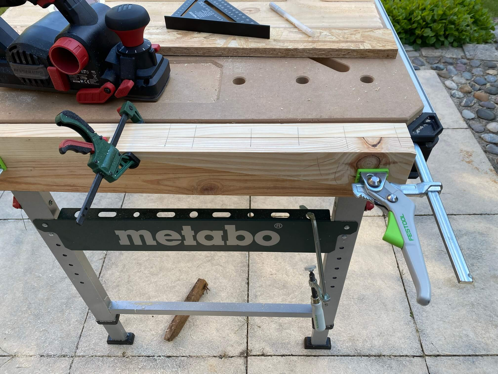
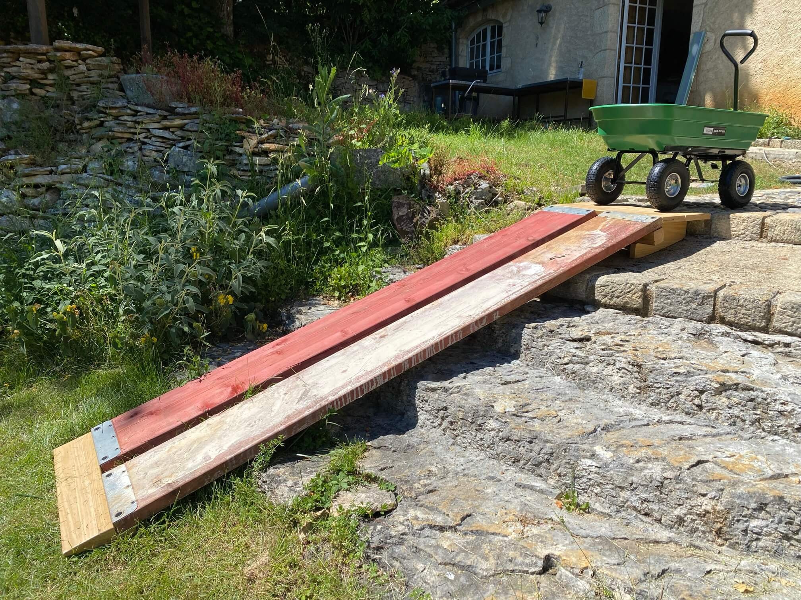

# Rampe

Aufgabenstellung, Gerüstbretter, die für dies und das noch intakt gebraucht werden, irgendwie in eine Art Rampe umzufunktionieren, da viel schweres Zeugs demnächst transportiert werden muß und generell Rasenmäher und Gartenwagen streßfreier über die Stufen kommen sollten. Ausgangsbasis war ein schiefes Brett mit den Maßen 28x195x2500mm und ein 7x7x71cm-Balken, der zwengs Faulheit die Breite der ganzen Konstruktion bestimmte.

Die Gerüstbretter haben zwei 20mm-Löcher an jedem Ende, also gilt es, die zu nutzen, um das Ganze "steckbar" zu machen. Also nen Meter 18mm-Rundholz gekauft, das achtmal mit der Oberfräse abgerundet und dann mit Handsäge auf Maß gebracht wird, um später in 18mm-Bohrlöchern eingeleimt zu werden.

#### Rundholz peu à peu abrunden und ablängen:

#### 17°-Winkel ermittelt, zweimal aus dem Brett rausgesägt und in Folge für das Fußteil schichtweise verleimt:

#### Ziemlicher Aufriß, das ohne Verrutschen zu verleimen:

#### 

#### Beim Kopfteil kommt CAD (Cardboard Aided Design) zum Einsatz. Erst wenn es passt, wird auf Holz übertragen.

#### 

#### Nicht genügend Holz, um alles in einem Stück auszusägen, also zwei Abschnitte zusammenleimen:

#### 

#### Nun braucht es nur noch 8er Holzdübel:

#### Fußteil bereit für Glätten mit Elektrohobel und Schleifer, dann Holzschutz drauf:

#### 

#### Nun mit Kartonstücken den oberen Abschluß markieren:

#### Karton auf Karton übertragen

#### Karton auf Holz übertragen

#### Brett gesägt, Kanten angefast, Holzschutz drauf und final verschraubt:

#### Auch Gartenwagen funktioniert prächtig:

#### Final nochmal ne Runde Holzschutz drauf:

