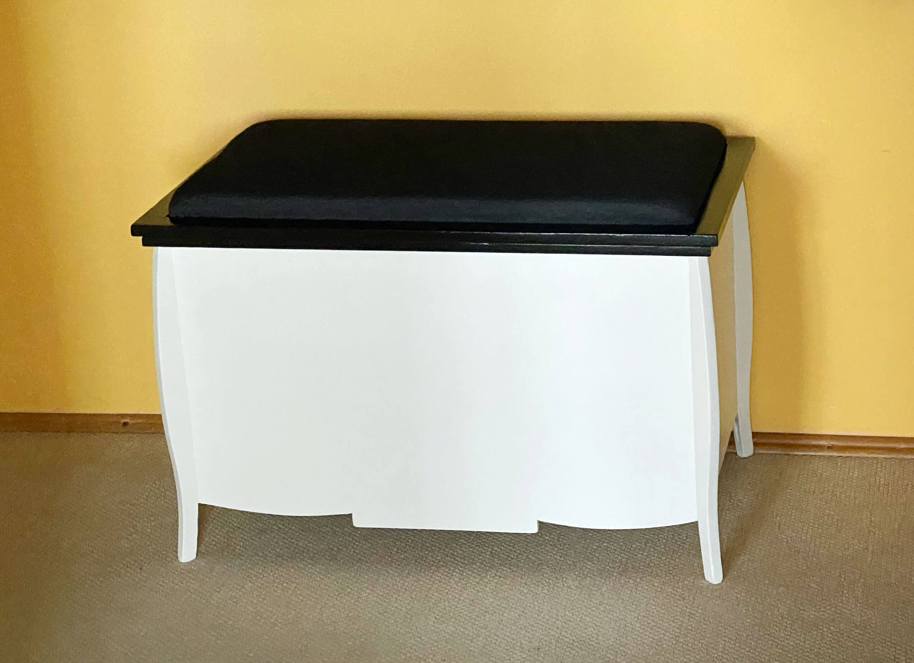
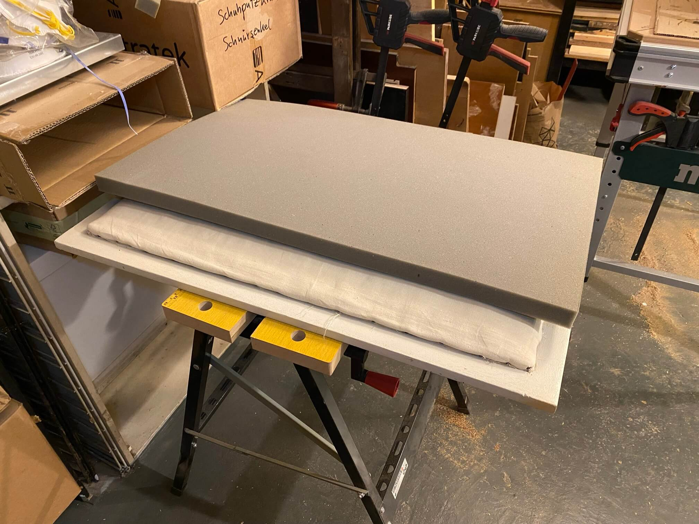
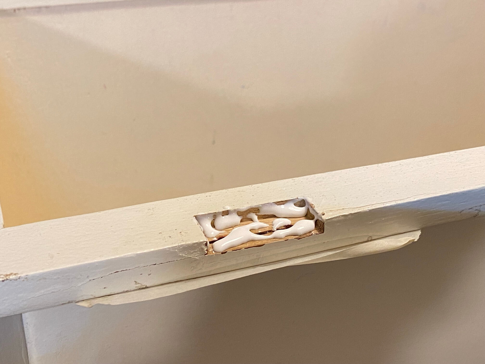

# Sitztruhe

Das Ding "war schon immer da" – keine Ahnung, wie lange schon in der Familie von Generation zu Generation weitergegeben:

Zuletzt bei der Tochter vom Enkel kaputtgespielt worden. Truhe rumgetragen und peng war der Deckel ab. Holzrand ausgebrochen und Deckel lag am Boden. An der Zeit, die Truhe wieder frisch und bisschen sicherer zu machen.

#### Passt Reststück Schaumstoff (vor dreiviertel Jahr mehrere Sitzkissen für Euroboxen gemacht, damit Tochters Familie Campingspaß hat)? Passt!

#### Zuletzt vor ca. 30 Jahren lackiert und neu bezogen hab ich damals wieder die originalen Nägel in die Seiten geklopft:

#### Rechts wird das gebrochene Holz geleimt. Und der Originalbezug sah sicher mal besser aus:

#### Klassisch mit Rosshaar aufgepolstert gewesen:

#### Das Deckelbrett ist arg ramponiert, wird bisschen aufwändiger, das wieder aufzupäppeln:

#### Die zwei eingelassenen Scharniere kommen weg, die Stellen werden 4mm tief ausgefräst und dann Brettchen eingeleimt:

#### 

#### 

#### 

#### 

#### Auf der linken Seite gab es einen Vorschaden, der nicht ordentlich verleimt war. Also auf ca. 40 cm Länge einen Zentimeter wegsägen und dann das Ganze flicken:

#### Dübelleiste im Einsatz:

#### 

#### Das Gegenstück wird mal wieder ein Schubladenseitenteil meines uralten Schreibtisches:

#### Zehn 6er Holzdübel auf 23mm kürzen:

#### Bereit zum Verleimen:

#### 

#### Am nächsten Tag das angeleimte Brett formatieren. An der Unterseite bisserl mit dem Stechbeitel üben:

#### Oberseite grob mit der Tauchsäge vorgearbeitet, dann mit dem Bündigfräser hinterher:

#### 

#### Neue Lieblingshandsäge im Einsatz:

#### Nächster Schritt: die 10 durch Rundkopfschrauben im Deckel verursachten Beschädigungen flicken:

#### Fehlerstellen 6mm breit aufbohren und dann Holzdübelabschnitte einleimen. Selbes Spiel mit dem Deckel:

#### Nun sukzessive den Deckel aufpäppeln, also mit Holzresten und Holzleim reihum wieder in Form bringen:

#### 

#### 

#### Lieblingssäge für Feinkram geeignet:

#### 

#### 

#### 

#### Erste Runde Spachteln:

#### 

#### Nun mit zwei Tauchsägen vier 45°-Leisten herstellen, die in die Ecken innen kommen, damit von dort aus jeweils 3 Schrauben die äußeren Beinchen stabilisieren können:

#### Spannvorrichtung zusammengeschraubt/-geklemmt, um die Oberseite der 45°-Leisten sicher mit der Oberfräse anschrägen zu können:

#### 

#### 

#### Rest macht der Tellerschleifer.

#### Testfitting passt:

#### Vorrichtung umbauen, um Bohrlöcher zu senken:

#### Ging so lala mit der El Cheapo kwb-Bohrlehre das jeweils unterste Bohrloch im 45°-Winkel zu senken:

#### Leisten finalmente verschraubt und in Folge verspachtelt:

#### 

#### Zwei gröbere Ausrisse im Deckel mit Oberfräse und Stechbeitel bereinigt, dann Holzflicken eingeleimt und glatt geschliffen:

#### 

#### Da es im Keller zu kalt für Lackieren ist, Umzug in die Wohnung. Erste Schicht Vorstreichfarbe aus dem letzten Jahrhundert drauf und in Folge ähnlich alten schwarzen Lack für Deckel, Truhenrand und innen:

#### 

#### 

#### Lose Lackstellen abkratzen, spachteln, schleifen, lackieren:

#### 

#### 

#### 

#### Umzug in die Rumpelkammer/Arbeitszimmer weil die Vorstreichfarbe aus dem letzten Jahrhundert unfaßbar kraß stinkt:

#### Nun endlich Deckel neu aufpolstern, Schaumstoff formatieren und mit Sprühkleber am Deckel fixieren:

#### 

#### Dann Polstervlies spannen/tackern:

#### 

#### Nachdem die Tochter den Stretch-Jeansstoff dankenswerterweise gebügelt hat, wird auch der festgetackert (Malerkrepp nur dazu da, um Klammerpositionen zu markieren)

#### Parallel das nervige Prozedere: Lackieren, schleifen, lackieren, schleifen...

#### 

#### 

#### 

#### 

#### Lange recherchiert und keine Winkel mit 10mm-Seitenlänge gefunden. Also Winkel im Format 10x28mm selbst aus L-Profil-Rest herstellen. Bohrlöcher halbwegs präzise mittels El Cheapo Bohrständer (man muß ordentlich vorkörnen und sich dann 0,5mm-weise bei den Bohrern vorarbeiten)

#### 

#### 

#### Nun aus der gebohrten Leiste sechs Winkel machen. Wieder ein klassischer Fehler: Referenz nicht bedacht und einmal von hier und einmal von dort gemessen: am Ende alles schief aber Wurscht:

#### 

#### 

#### So wie im Vordergrund hätten die Dinger werden sollen aber natürlich symetrisch. Doch egal, Lernerfolg mitgenommen, dass sich kleine Toleranzen bei kleinen Maßen groß auswirken:

#### Farbrolle mit schwarzem Lack war noch eng in Plastiktüte eingewickelt also flott die Dinger lackiert.

#### Deckel fertig "montiert"

#### Zwischendurch Klavierband gekürzt. In Zukunft verbinden Deckel und Truhe sechsundzwanzig und nicht mehr nur vier Schrauben.

#### Am Deckel wurde noch ringsrum 3mm-starkes Dichtungsband appliziert, damit auch Kinderhände das Zuschlagen des Deckels in Zukunft unbeschadet überstehen:

#### Finalmente fertig. Dunkler Bezug sicherlich nicht doof, wenn viel drauf gesessen wird aber das Resultat mit dem schwarzen Rand gefällt nicht wirklich. Nur aktuell keine Lust mehr auf Lackieren, also bleibt es jetzt erstmal so:

