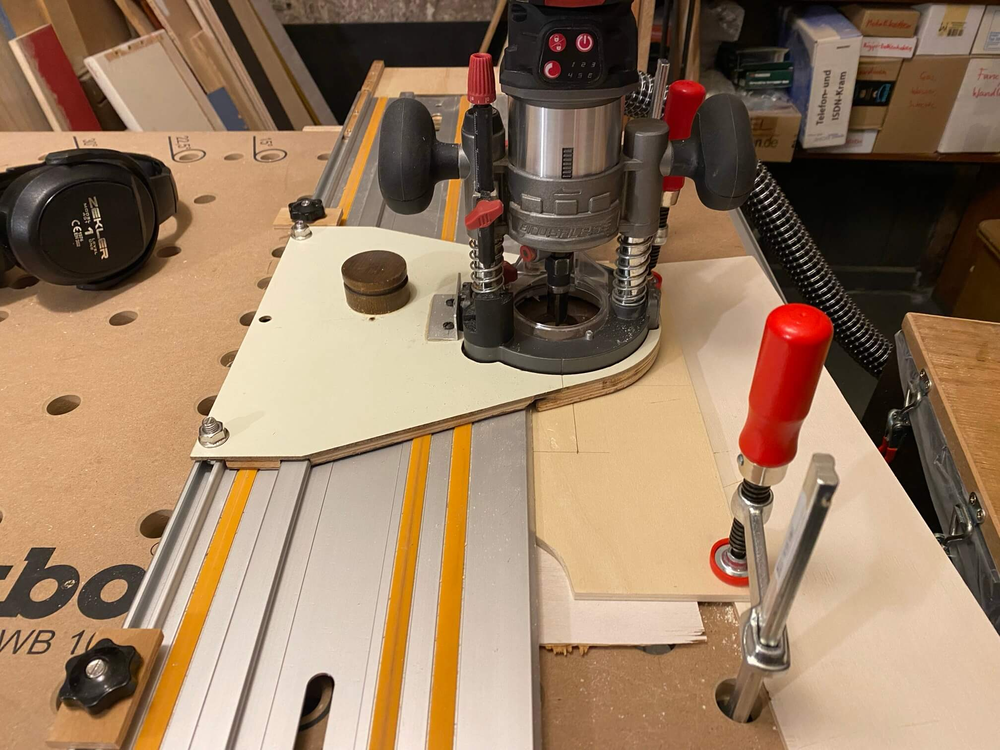

# Einsätze für "Sortimentsbox XL"

Ziel ist, zwei Einsätze für Schleifmittel und drei Schleifgeräte (2 x elektrisch, 1 x manuell mit Absaugung) zu bauen, um das ganze Zeugs in einer Parkside-"Sortimentsbox XL" (ca. 44 x 36 x 39 cm) zu verräumen:

Diese Sortimentsboxen sind billigst gemacht, waren Frühjahr 2025 im Angebot und für je nen 10er habe ich mir zwei geholt. Also nun mit Gratis-Holz von [Treibgut](http://treibgut-lager.de) zwei Einsätze bauen:

#### Erstmal 45°-Abschnitte vom [Sitztruhe-Projekt](../Sitztruhe/README.md) mit der Tauchsäge halbieren:

#### 

#### Das werden dann die 45°-Ecken an einer Seite:

#### 45°-Schnitte mit [Klappschiene](../Klappschiene/README.md) und Bankhaken so simpel:

#### Boden und Längsseiten 6mm stark, die anderen Seiten 4mm:

#### Einfach mal forsch drauflosgeleimt. Hat sich "völlig überraschend" alles bisschen verzogen aber am Ende hält es und die Innenmaße passen noch immer:

#### Lektion gelernt: der zweite Einsatz wird komplett aus 6mm Sperrholz gebaut (dünnster Fräser hier 6mm) und Falze/Nuten sorgen dafür, dass beim Leimen weniger verrutscht:

#### Mit dem Schienenadapter wird präzise 1,5mm tief in den Boden und partiell in die Seitenteile gefräst:

#### Test-Fitting passt:

#### Grifföffnung in Mittelteil fräsen:

#### 

#### Mit Handsäge, Feile und Kantenfräse finalisieren:

#### Alles bis auf die 45°-Ecken verleimen:

#### Am nächsten Tag dann die Ecken einleimen (vier Zwingen spreizen, sechs klemmen):

#### Nun 45°-Abschnitte als Griffverstärkung einleimen:

#### Am Folgetag mit Handhobel und Schleifer aus eckig rund gemacht:

#### Einsätze fertig. Ganz unten in der Box sind ca. 6cm Platz für Schleifpapier:

#### Der Einsatz für die Schleifgeräte wurde mit Schaumstoff ausgekleidet (Verpackungsmaterial von Sägeschiene):

#### Zweiter Einsatz drauf und alles ist in einer Box:

