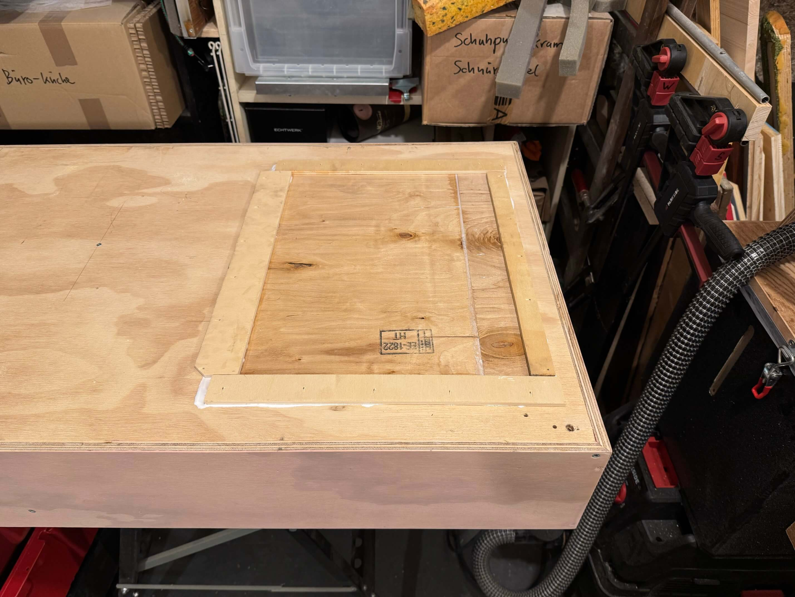

# Werkzeugschrank / Stauraum

Schon länger überlegt, wie man den Platz über den "geerbten" Metallregalen sinniger nutzen kann, dann bei [Treibgut-Besuch](http://treibgut-lager.de) einen Werkzeug-Wandschrank gesehen, der für lau abgegeben wurde (120x60x16cm).

Den [Anhängerdeckel](https://github.com/ThomasKaiser/Basteln/blob/main/media/Anhaengerdeckel/README.md) hatte ich gerade für solche Situationen geplant, also Expander einpacken, Schrank aufladen und ab in die Werkstatt.

#### Schrank auf Anhänger

#### In der Rückwand ist auf der einen Seite eine große Öffnung, ergo Holzabschnitt suchen, der ca. passt, und mit dünnen Abschnitten zusammenleimen:

#### Rückwand-Einsatz mit Randleisten kurz vor Verleimung:

#### Und verleimt (10mm-Nägelchen zur Fixierung reingeschossen)

#### Ansicht von innen im Anschluß:

#### Da auf dem Dingens am Ende Holz gelagert werden soll, noch uralte Spanplatte zurechtgeschnitten und als Deckel drangeleimt:

#### Schrank auf Regal fixiert und von unten und links an einigen Stellen verschraubt

#### Deckelrand mit Multiplex-Latten verstärkt:

#### Vertikaler Support für OSB-Reststück, das hier komplett abschließen wird:

#### Vorerst fertig, außen "Werkzeugwand", innen und dahinter Stauraum:

#### 

#### Mit Winkel das ganze Dingens extrastabil machen:

#### Und letzter Schritt: Latten mittels Ketten an Decke befestigen, um in Zukunft Holz zu lagern.

