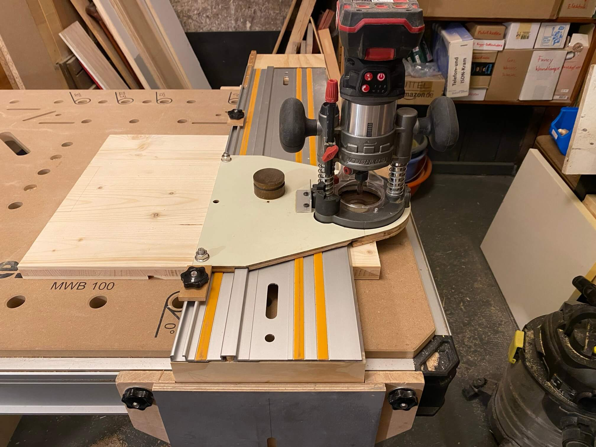
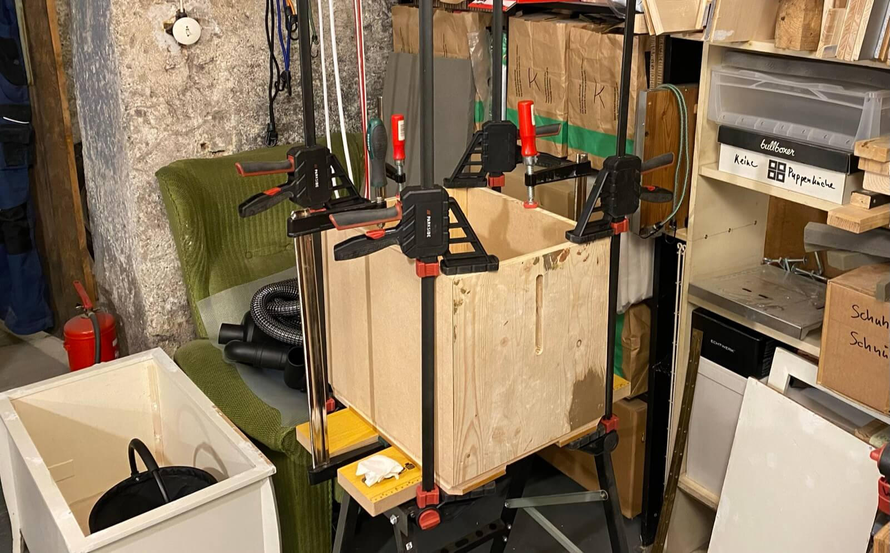
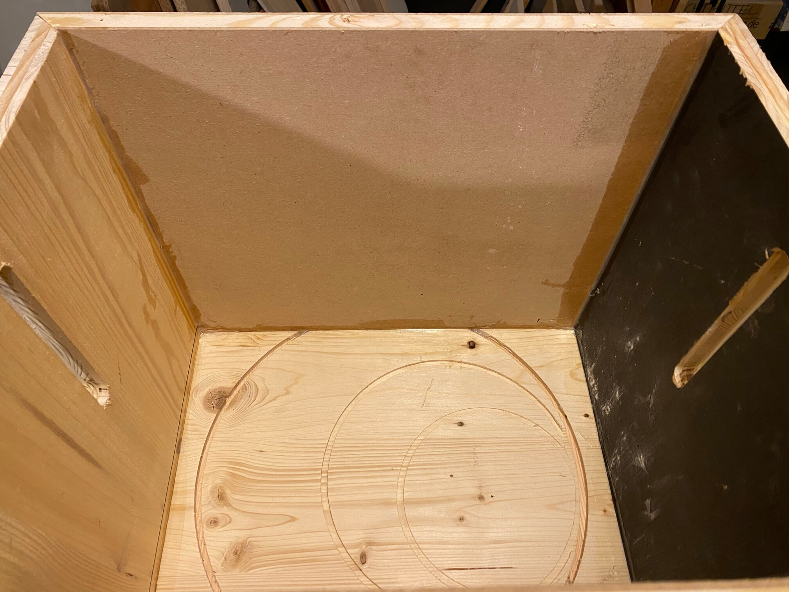
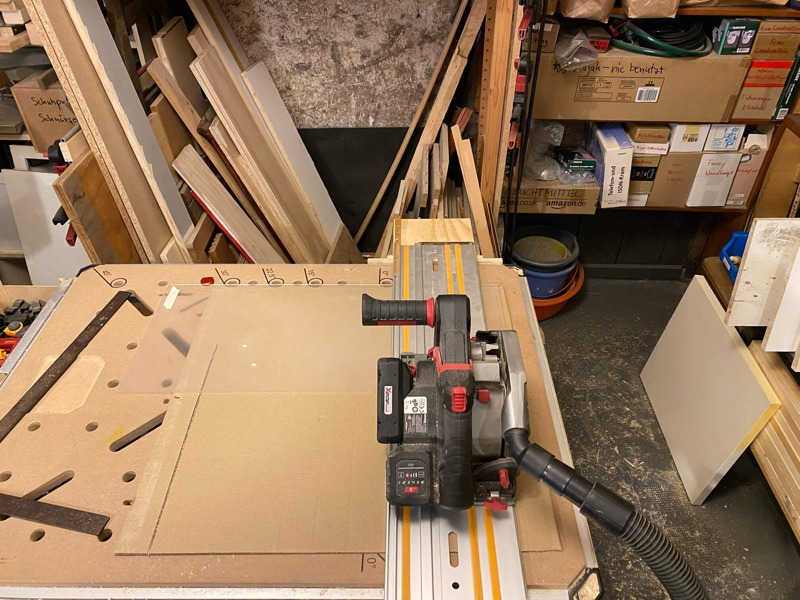
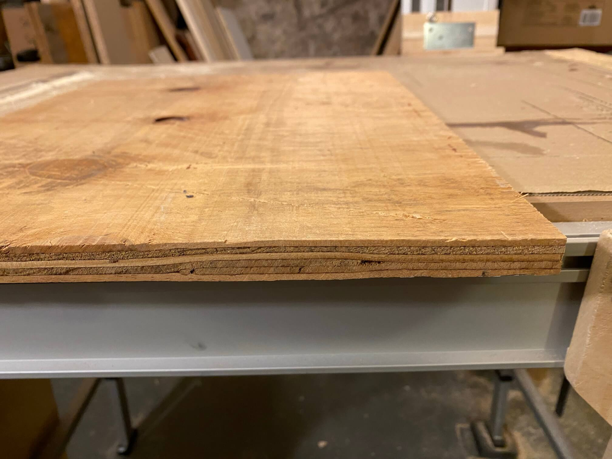

# Zyklon-Vorabscheider für Werkstattsauger

Das kleine Vorbild im Vordergrund und dahinter der Nachbau:

Februar 2025 einen Werkstattsauger PPWD 30 B2 für 199,-€ geschossen stand dann die Installation eines Zyklon-Vorabscheiders an.

Die übliche Variante ist die, den Zyklon mit einem Stahlfaß zu kombinieren und es gibt [haufenweise Videos, wie lustig das ist, wenn das Faß durch Unterdruck zerstört wird](https://www.youtube.com/watch?v=ozTCsfFssBc&t=552s).

Also Holzkiste drunter statt Faß. Und Doppelzyklon weil effizienter und auch mehr feineres Zeugs abscheidend:

Teileliste:

  * [Pemedor Doppelzyklon](https://www.temu.com/goods.html?_bg_fs=1&goods_id=601099523105129)
  * [Zyklon-Schlauchset von Staubsauger-Manufaktur](https://www.staubsaugermanufaktur.de/Schlaeuche/Fuer-Zyklon-Abscheider/Gewebeschlauch-Set-fuer-alle-Industriesauger-58mm-und-Zyklon-Abscheider-50mm-Anschluss::51558.html)
  * [Dichtungsband](https://www.temu.com/goods.html?_bg_fs=1&goods_id=601099632426312&sku_id=17592645636693)
  * [10 justierbare Kistenschnallen](https://www.temu.com/goods.html?_bg_fs=1&goods_id=601099592108905&sku_id=17592504192957)
  * Das ganze Holz Kellerfunde oder für lau von [Treibgut](http://treibgut-lager.de)
  
#### Herausforderung: klickbar

Lidl läßt von Conmetall Meister sog. "Sortimentsboxen" aus China importieren, die auf den Staubsauger oder ein Rollbrett oder aufeinander gesetzt und arretiert werden können. Daher wird das mit Holz und Resten eines Alu-L-Profils nachgebaut, damit die Kiste sicher fixiert werden kann:

#### 1. Schritt: Boden formatieren (45°-Ecken und Vertiefungen)

#### Rundum an den Boden unten 10mm starke Brettchen anleimen

#### Dann kompatibel zu Sauger und Rollbrett machen (mit [Klappschiene](../Klappschiene/README.md) und Bankhaken endlich alles so simpel):

#### Der letzte Überstand kommt mit der Zugsäge weg:

#### Mal wieder Gehrung üben, 45°-Winkel passt diesmal:

#### Beim Verleimen erst festgestellt, dass nur 7 ausreichend lange Zwingen existieren, wird also wieder schief das Ganze:

#### Aluprofil kürzen:

#### Mittels Opferholz, Winkeln und paar Zwingen dann in 45° ablängen:

#### Zwischenergebnis passt, arretiert sauber auf sowohl Sauger als auch Rollbrett:

#### Langlöcher in 2mm Holzbrettchen fräsen für "Füllstandanzeiger"

#### Kombiniert mit Plexiglas und Langloch im Korpus kann man später durchgucken:

#### Langloch auf der anderen Seite fräsen:

#### Weil irgendwer an dem Brett Kreisfräsen geübt hat, in den Boden außen einen 7mm tiefen Falz fräsen, in den dann der Korpus eingeleimt wird:

#### Bisschen Sanitärsilikon in die Fugen (eher Blödsinn, weil die Kiste muß ja Unterdruck abkönnen am Ende):

#### Zweiter Ansatz Plexiglas (3 mm stark statt 2 wie ursprünglich geplant)

#### Nun 5 mm tief fürs Plexiglas fräsen und dann 2 mm fürs Holzbrettchen:

#### Passt:

#### Plexiglas mit 2K-Kleber fixiert, Brettchen mit Holzleim:

#### 0,5mm Überstand korrigieren:

#### Erste Runde Spachteln nachdem die Ecken mit 32mm-Nägelchen verstärkt wurden:

#### In den Deckel wird eine 3mm-Vertiefung für den Zyklonrand gefräst und anschl. in mehreren Tiefenschritten die eigentliche Öffnung:

#### Da der Kistenbauer kreativ (bzw. dumm) war und der Korpus bisschen breiter und tiefer ausfällt als geplant, muß nun an den Deckel ringsrum Holz angeleimt werden, nur um kurz danach fast vollständig mit dem Bündigfräser wieder abgetragen zu werden, damit Deckel und Korpus exakt abschließen (sonst wird es nix mit den Kistenschnallen):

#### Horizontal mit Bündigfräser zweimal rundherum arbeiten:

#### Dann vertikal mit Bündigfräser Deckel exakt auf Korpusformat bringen:

#### In die Innenseite des Deckels außen 1,5mm tiefen Falz fräsen, in den dann Dichtungsband geklebt wird:

#### Dichtungsband in der Küche verklebt, weil die Kellertemperatur (10°C) laut Beipackzettel zu niedrig ist:

#### Das komische Muster ist Ergebnis von Elektrohobel, weil das Brett ein wenig fehlerhaft war:

#### Obere Befestigung für den Hauptzyklon mit Kreisfräser herstellen:

#### Der Ausschnitt der oberen Befestigung wird nun an die Innenseite vom Deckel geleimt, damit der Zyklon später mit Holzschrauben am Deckel befestigt werden kann:

#### Die eingeleimte Deckelverstärkung erst mit Kreisfräser und Zentrierloch bearbeitet:

#### Dann mit Bündigfräser von der anderen Seite komplett geöffnet:

#### Winkel für vertikalen Support ermitteln und übertragen:

#### Eigentlich sollte das Ganze filigraner und die Innenteile ausgefräst werden aber erstmal Schnauze voll von Staub:

#### Zyklonmontage:

#### Die Seitenteile bleiben erstmal "massiv":

#### Montage war eigentlich anders geplant aber da hätte ins Dichtungsband geschraubt werden müssen also den Aufbau um 90° gedreht:

#### Eigentlich Blödsinn, das Ding zu lackieren aber da parallel an der Truhe gearbeitet zwei Lagen Lack drauf:

#### Gucklock funktioniert auch trotz milchigem Plexiglas und "Müllbeutel" im Inneren:

#### Bislang nix, um Saugschlauch und Stromkabel zu verstauen also noch zwei Anbauten dran:

#### Zyklon (jetzt mit Kabel-/Schlauch-"Ordnung") trifft [Truhe](../Truhe/README.md).

